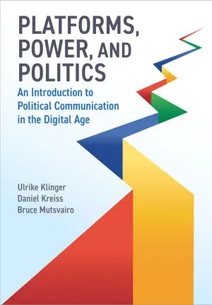

background-image: url(https://upload.wikimedia.org/wikipedia/en/6/6a/Logo_of_the_University_of_Sydney.svg)
background-size: 95%

```{r setup, include=FALSE}

knitr::opts_chunk$set(echo = TRUE, message = FALSE, warning = FALSE, 
                      dev = 'svg', out.width = "45%", fig.width = 6,
                      fig.align="center")

```

---

## Acknowledgement of Country

I would like to acknowledge the Traditional Owners of Australia and  recognise their continuing connection to land, water and culture. The  University of Sydney is located on the land of the Gadigal people  of the Eora Nation. I pay my respects to their Elders, past and present.

---

## Your teacher
	
Francesco Bailo (francesco.bailo@sydney.edu.au)

I am a Lecturer in the School of Social and Political Sciences, University of Sydney. I am interested in researching forms of political engagement and political talk on social media. I researched the emergence and dynamics of online communities, the role between news organisations and social media, and the interdependence between social media activists and news organisations. I have engaged with and applied quantitative research methods developing expertise in quantitative text analysis (NLP) and network analysis.

This year I am teaching GOVT3901, SSPS4102/SSPS6006 and GOVT6139 


---

## Housekeeping

.pull-left[
### Scheduled classes
  1. Lectures (13 scheduled) 
  2. Tutorial (11/12 scheduled)
  
### Canvas 
  1. Unit information (Readings, Announcements, Materials, etc)
  2. Engagement with content (Weekly discussion board)
  3. Submission of all assignments
]

.pull-right[
  
### Assignments 
  1. Group submission (20%)
  2. Individual submissions (30% and 40%)
  
### Participation grade (10%)  
  1. Attend classes (lectures and tutorials)
  2. Engage with in-class tasks
  3. Engage during tutorials 
  4. Engage on Canvas (weekly discussion boards)
  
]

---

## Weekly readings: Textbook  and Journal articles

.center[.content-box-purple[Check the reading list from Canvas!]]

.pull-left[*Platforms, power, and politics: An introduction to political communication in the digital age* (2023). Polity.

- **Ulrike Klinger** is Professor of Political Theory and Digital Democracy at the European University Viadrina.

- **Daniel Kreiss** is the Edgar Thomas Cato Distinguished Professor in the Hussman School of Journalism and Media at the University of North Carolina at Chapel Hill.

- **Bruce Mutsvairo** is Professor and Chair of Media, Politics and the Global South at Utrecht University.

]
.pull-right[.center[]
</img></img></img>


]

---

## High-Level Overview: Political Communication in the Platform Era

- This course explores how digital platforms have transformed political communication.
- We analyse key concepts such as media, platforms, misinformation, populism, and governance.
- Topics range from journalism and election campaigns to political extremism and entertainment.
- By the end, you will be able to critically assess the role of platforms in shaping public discourse and democracy.

.center[]

---

## Weekly Course Breakdown

### **Weeks 1-4: Foundations of Political Communication**
1. **Introduction to Political Communication** – Key terms, historical shifts, and the rise of platforms.
2. **Definitions and Variations** – Global perspectives and political system influences.
3. **Platform Power** – Affordances, algorithms, and political influence.
4. **Public Spheres & Opinion** – Echo chambers, counterpublics, and digital debate.

### **Weeks 5-8: Political Actors & Strategies**
5. **Platforms and Journalism** – News distribution, data journalism, and business models.
6. **Strategic Communication** – Political marketing, lobbying, and digital PR.
7. **Campaigns & Elections** – Data-driven campaigns and political mobilization.
8. **Social Movements** – Digital activism, protest cultures, and online mobilization.

---

### **Weeks 9-13: Key Challenges & The Future**
9. **Platform Governance** – Regulation, policies, and corporate self-governance.
10. **Misinformation & Propaganda** – Disinformation, fact-checking, and polarization.
11. **Populism & Extremism** – Radicalization, democratic backsliding, and digital threats.
12. **Entertainment & Politics** – Celebrities, influencers, and political culture.
13. **The Future of Political Communication** – Emerging trends, challenges, and opportunities.


---

## Today's class: Introduction to Political Communication in the Platform Era (Ch 1)
- Explain the intricate relationship between media, technology, and political communication, tracing historical developments and modern transformations.
- Define key terms such as media, digital media, the Internet, social media, platforms, and technologies, ensuring clarity in conceptual understanding.
- Recognize the importance of analysing digital platforms within contemporary political communication.

---

## Angela Merkel’s Reflection on Digital Media

- Angela Merkel, former Chancellor of Germany, offered a reflection on how political discourse has changed due to digital media in **2021** during a farewell interview
- She noted that in **2005**, when she assumed office, smartphones, Facebook, and Twitter were either non-existent or in their infancy.
- Merkel expressed concerns that digital platforms contribute to a harsher political climate by reinforcing ideological silos and reducing opportunities for constructive debate.
- This highlights a central theme of the textbook: the evolving landscape of political communication in the platform era.

.center[</img>]

---

## The digital revolution

#### The massification of Internet technologies has revolutionised how people connect with each other and access information.

.pull-left[
 The **Social Media Revolution** involves a shift in how people relate to each other. This revolution has created opportunities and stresses for people to reach beyond tight-knit groups, allowing for more **diversity** in relationships, but also introducing the stress of not having a single home base.

.center[</img>]

 .center[On .content-box-yellow[September 26, 2006], **Facebook** opened to everyone 13+ with a email address.]
 
]

.pull-right[
The **Mobile Revolution** involves mobile phones evolving from simply ways to talk on the fly to becoming key to **always-available accessibility**. The increasing use of mobile access has enhanced the ascent of broadband and the always-on Internet.

.center[</img>]

.center[The first **iPhone** went on sale on .content-box-yellow[June 29, 2007].]

]

.footnote[Rainie, L., & Wellman, B. (2012). **Networked: The new social operating system**. MIT Press.]

---

## What does the Digital Revolution mean for social networks?

- The key change in how people connect socially is a shift **from being embedded in groups** to becoming **networked individuals**. 

- Instead of primarily functioning as members of a family, work unit, neighbourhood, or social group, **people increasingly operate as individuals connected through diverse networks**.

- **Partial membership in multiple networks**: Networked individuals have connections to many networks rather than relying on permanent membership in settled group.

- **Looser, more fragmented networks**: The new social environment is oriented around networks that are less tight-knit than in the past.

> "The new media is the new neighborhood" (p. 13).

- The emerging role of **digital platforms** in *creating*, *mediating* and *curating* connection among people and between people and information (i.e. content).

.footnote[Rainie, L., & Wellman, B. (2012). **Networked: The new social operating system**. MIT Press.]

---

## The Digital Transformation of Political Communication

- Traditional political communication was structured around mass media, such as newspapers, radio, and television.

- The Internet and digital media have revolutionised the way information is disseminated and consumed, making communication more participatory and interactive.

- Platforms like TikTok, Facebook, Twitter (now X), and YouTube serve as intermediaries, influencing what information reaches the public and how political actors engage with audiences.

- This shift has raised questions about misinformation, polarisation (especially in the U.S.), and the role of algorithms and who controls them in shaping political discourse.

---

## The Role of Technology in Political Communication

- **Technology has always played a role in shaping political communication.**

- Oral traditions helped societies transmit political narratives before the advent of writing systems.

- The printing press, telegraph, radio, and television each transformed political discourse in distinct ways.

- The rise of the Internet and social media and digital platforms has brought about a decentralized, user-driven form of political communication, changing how politicians, activists, and the public interact.

---

## The Internet and the Platform Era
- The Internet became a major force in global politics in the late 1990s and early 2000s.
- The widespread adoption of smartphones accelerated the shift towards mobile-first digital interactions.
- The Arab Spring demonstrated the potential of social media to mobilize protests and activism, while subsequent events, such as Brexit and the 2016 U.S. elections, highlighted concerns about digital manipulation and disinformation.
- The platform era signifies the dominance of a few large corporations in structuring political conversations, often with opaque algorithms determining visibility and engagement.

---

## The Dual Nature of Platforms
### Positive Impacts:
- Increased political engagement and mobilization through digital activism.
- More access to diverse political viewpoints and alternative media sources.
- Enhanced transparency and direct communication between political leaders and the public.

### Negative Impacts:
- Communication power concentration (and emergence of a new form of power)
- The spread of misinformation and conspiracy theories (no editorial control by platforms).
- Algorithm-driven polarisation leading to echo chambers and filter bubbles.
- The commodification of political discourse through data-driven advertising and microtargeting.

---

## Platforms and Political Actors
- **Political leaders** use platforms to engage directly with constituents, bypassing traditional media gatekeepers.
- **Journalists** rely on social media for real-time reporting and audience engagement.
- **Civil society organizations** leverage digital platforms for advocacy, petitions, and awareness campaigns.
- **Citizens** use social media to participate in political discussions, share content, and mobilize for causes.
- The interplay between these actors reshapes political communication in fundamental ways.

---

## Platform Power and Media Systems
- Platforms serve as both **infrastructure** and **gatekeepers** of political discourse.
- Affordances of platforms, influence what information gains traction.
- Media systems are increasingly **hybrid**, blending traditional broadcast media with digital-first content distribution.
- Example: Twitter (before Elon Musk bought it in 2022) had became a primary space for political scandals and crisis management, forcing traditional media to respond to trending digital conversations.

---

## What are affordances?

Bucher and Helmond (2018) define affordances as a **relational property that describes the possibilities for action provided by an environment or technological system**. The concept originates from ecological psychology and has been adapted in design studies and media research. In the context of social media platforms, affordances are *not static* features but *dynamic relationships* between *users and the platform*'s technological architecture.

In essence, affordances define .content-box-yellow[what users can do on a platform], but .content-box-yellow[they do not dictate behaviour]—rather, they .content-box-yellow[structure possibilities and constraints within the platform environment].

.footnote[Bucher, T., & Helmond, A. (2018). The Affordances of Social Media Platforms. In J. Burgess, A. Marwick, & T. Poell, The SAGE Handbook of Social Media (pp. 233–253). SAGE Publications Ltd. https://doi.org/10.4135/9781473984066.n14]

---

## Affordances are ...

.blockquote[
### `r icons::fontawesome("wrench")` Affordances
- **Relational Nature**: Affordances exist in the interaction between users and the platform; they are not just built-in features but also shaped by user expectations and behaviors.
- **Perceived vs. Hidden Affordances**: Some affordances are immediately visible and easily understood by users (e.g., a "Like" button), while others may require exploration or experimentation (e.g., algorithmic content curation).
- **Communicative and Social Affordances**: Social media affordances enable different types of communication and social interaction, such as visibility (who sees what), editability (the ability to modify content), persistence (how long content remains available), and association (how users are linked to content and each other).
- **Platform-Sensitive Approach**: Affordances are platform-specific and influenced by changes in platform architecture, such as Twitter replacing the "Favorite" star with a "Like" heart, altering the perceived meaning of user interactions.
]

---

## First In-class task!

.center[.content-box-green[

In-class tasks during lectures are not assessed but participation is timestamped and recorded.

]]

.center[ 

or try https://sres.sydney.edu.au/go/67b810a74ca9f8033cbea6e2]

---

#### **What is the best definition of affordances?**
- A) The fixed technological features of a platform that dictate user behavior.
- B) The possibilities for action provided by a platform, shaped by both design and user perception.
- C) The way a platform's algorithms completely control user interaction.
- D) The visual design of a platform that makes it aesthetically appealing.

#### **Which of the following are examples of affordances in social media?** *(Select all that apply.)*
- A) The ability to like, comment, or share posts on a platform.
- B) The price of a social media subscription.
- C) Algorithmic curation of content that influences what users see.
- D) A platform’s terms of service and privacy policy.
- E) The option to tag other users in a post.

---

#### **Which of the following statements about affordances is TRUE?**
- A) Affordances are static and do not change over time.
- B) Affordances are relational—they depend on both platform design and user perception.
- C) Affordances completely determine how users behave on a platform.
- D) Affordances are the same across all platforms.

---

## Global Variations in Platform Governance
- The regulatory landscape of digital platforms varies significantly across different regions:
  - **United States:** Emphasis on free speech with limited platform regulation.
  - **European Union:** Stronger data protection and content moderation policies.
  - **China & Russia:** State-controlled platforms with strict content guidelines.
- The notion of a "splinternet" reflects the increasing fragmentation of digital spaces due to national regulations.

---

## Defining Key Terms
1. **Media** – Encompasses all forms of communication, including traditional and digital formats.
2. **Digital Media** – Media content distributed in digital formats, accessible via the Internet.
3. **Internet** – A global network enabling connectivity and data exchange.
4. **Social Media** – Platforms that facilitate user-generated content and networked communication.
5. **(Digital) Platforms** – Digital infrastructures that organize and curate information, interactions, and transactions.
6. **Technologies** – Broadly refers to tools, knowledge, and processes that shape communication and society.

---

## Key Takeaways
- The platform era has fundamentally altered political communication.
- Digital media amplify both democratic engagement and the risks of information disorders.
- Platforms shape political discourse, engagement, and governance through their affordances and algorithms.
- Regulatory environments influence how platforms operate globally.
- Understanding media systems in political communication requires a multidisciplinary approach.

---

## Attendance: Get your phone out again!


---
class: inverse, center, middle

# Any Quick Question?

---
class: center, middle

# See you next week!


