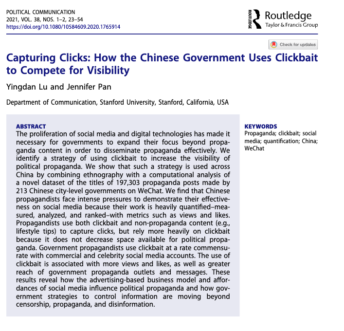
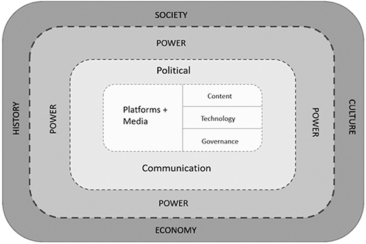

background-image: url(https://upload.wikimedia.org/wikipedia/en/6/6a/Logo_of_the_University_of_Sydney.svg)
background-size: 95%

```{r setup, include=FALSE}

knitr::opts_chunk$set(echo = TRUE, message = FALSE, warning = FALSE, 
                      dev = 'svg', out.width = "45%", fig.width = 6,
                      fig.align="center")

```

---

## Acknowledgement of Country

I would like to acknowledge the Traditional Owners of Australia and  recognise their continuing connection to land, water and culture. The  University of Sydney is located on the land of the Gadigal people  of the Eora Nation. I pay my respects to their Elders, past and present.


---

.content-box-green[

**Note** When not otherwise referenced, materials are based on and adapted from from Klinger, U., Kreiss, D., & Mutsvairo, B. (2023). *Platforms, power, and politics: An introduction to political communication in the digital age*. Polity.

]


---

## **Introduction**

> Politics deals with relations, power, identity, and decision-making.

- Political communication is more than just elections and policymaking—it shapes and reflects power, identity, and public life.

> [Political] communication creates what people understand to be political.

- Communication is symbolic and takes many forms: speech, text, images, video, and digital media.

- Platforms have changed political communication, but historical, social, and institutional factors still shape how it functions.

---

## **Defining Political Communication**

- Political communication is "communication about politics"—but what counts as political is constantly evolving.
- It includes messages about power, governance, identity, and public issues.
- Political communication can turn private matters into public debates (e.g., domestic violence, LGBTQIA+ rights, or racial justice movements).

---

## Examples of Political Communication

**1. Political Campaign Advertisements**

During election seasons, candidates utilise various media channels to disseminate their messages. These advertisements can be **positive** (i.e. *positive campaigning*), highlighting a candidate's achievements and policy proposals, or **negative** (i.e. *negative campaigning*), aiming to undermine opponents. A notable example is the "Daisy" ad from the 1964 U.S. presidential election, which used the imagery of a nuclear explosion to question the opponent's stance on nuclear policy.

.center[
<video controls autoplay width="450">
        <source
            src="https://upload.wikimedia.org/wikipedia/commons/transcoded/5/5f/Daisy_%281964%29.webm/Daisy_%281964%29.webm.720p.vp9.webm"
            type="video/webm">
        Your browser does not support the video tag.
    </video>
]

---

## Examples of Political Communication

**2. Social Media Engagement**

Today politicians actively use platforms like Twitter/X, Facebook, and Instagram to connect with constituents, share policy positions, and respond to current events. 

Recently, U.S. President Trump published on his Instagram account an [AI-generated video ](https://www.instagram.com/reel/DGhfpgHsOg6/?utm_source=ig_web_copy_link) about his video for the reconstruction of Gaza.

Let's have a look... [link to ABC website with comment by Professor Jean Burgess QUT (1'50'' - 5'00'')](https://www.abc.net.au/news/2025-02-27/donald-trump-shares-ai-generated-video-of-his-gaza-plan-/104988430)

---

## Examples of Political Communication

**3. Grassroots Movements and Hashtag Activism**

Citizen-led initiatives often employ social media to mobilize support and raise awareness on specific issues. Movements like #BlackLivesMatter and #MeToo have harnessed the power of hashtags to create global conversations and influence policy changes.

.center[</img> ]

.footnote[*Anti-Racism Protest in Brisbane, Queensland, Australia. 6 June 2020. This protest was in support of Black Lives Matter and associated protests in the United States following the killing of George Floyd - but also highlighted parallel issues within Australia such as the deaths of Australia's aboriginal people while in police custody. Credit: Andrew Mercer via Wikipedia*]

---

## Examples of Political Communication

**4. Political Satire and Entertainment**

Television shows such as "Saturday Night Live" use satire to comment on political events and figures, shaping public perception through humour. These portrayals can influence how politicians are viewed by the public, blending entertainment with political commentary.

**5. Political Memes**

In the digital age, **memes** have become a popular medium for political expression, allowing individuals to quickly disseminate opinions and critiques. For example, during various election cycles, memes have been used both to support candidates and to satirize opponents, influencing public discourse in a humorous yet impactful manner.

.center[</img>]

---

## Examples of Political Communication

**6. Lobbying and Advocacy Campaigns**

Organisations and interest groups engage in lobbying efforts to influence legislation and public policy. This can involve direct communication with lawmakers, public campaigns, or mobilizing supporters to contact their representatives.
Wikipedia

**7. Political Debates**

Televised debates provide a platform for candidates to present their policies and challenge opponents, offering voters insight into their positions and personalities. These events are pivotal in shaping voter opinions and can significantly impact the trajectory of a campaign.

---

## **Key Actors in Political Communication**
- Political communication is produced by a variety of actors:
  - **Political elites** (elected officials, parties, candidates) and **political entrepreneurs**
  - **Journalists** and media organizations
  - **Advocacy groups** and **movements**
  - **Citizens**, influencers, and everyday social media users
  - **Algorithms**, bots, and **platforms** themselves
  

---

## Let's talk about platoforms as political actors. How do they shape political communication?

Platforms control three criticial (and relatively new) **forms of communication power**.

.content-box-red[

**Platforms** shape political discourse through 

1. **instrumentarian power** (Zuboff, 2018), 
2. **curation power** (Gillespie, 2018), and 
3. **system administration power** (Bratton, 2016). 

]

.footnote[Zuboff, S. (2018). *The age of surveillance capitalism: The fight for a human future at the new frontier of power.* PublicAffairs. Gillespie, T. (2018). *Custodians of the internet: Platforms, content moderation, and the hidden decisions that shape social media*. Yale University Press. Bratton, B. H. (2016). The Stack: On software and sovereignty. MIT Press.
]

---

## Platform's communication powers


| **Forms of Power**            | **Definition**                                                                 | **Example in Political Communication**                                    |
|-----------------------------|----------------------------------------------------------------------------|---------------------------------------------------------------------------|
| **Instrumentarian Power** (Zuboff, 2018) | The ability of platforms to observe, interpret, and modify user behavior through data collection and predictive analytics. | Social media platforms use vast data analytics to target political ads, influence voter behavior, and shape political discourse through algorithmic predictions. |
| **Curation Power** (Gillespie, 2018) | The ability to filter, rank, and prioritize content through platform algorithms and moderation policies, thereby structuring what users see and engage with. | Platforms promote certain political messages or suppress others by adjusting newsfeed algorithms, shadow banning, or fact-checking content. |
| **System Administration Power** (Bratton, 2016) | The sovereign control platforms have over their infrastructure, including the ability to permit or deny access, regulate terms of service, and shape the technical standards for participation. | Twitter banning a political leader, Facebook altering API access for political campaign data, or governments negotiating content takedown policies with platforms. |

---

## **How Political Communication Varies Across Contexts**
- **Media systems**: Some countries have strong public broadcasters (BBC, ABC), while others rely heavily on commercial media.
- **Political structures**: Presidential vs. parliamentary systems shape how communication flows.
- **Regulation & press freedom**: Some states allow free press, while others censor and control media.
- **Cultural & historical influences**: Different societies prioritize different political issues and communication styles.

.content-box-yellow[

### What is an audience?

A group of people who are immersed in a common experience through the same medium. 

- A traditional understanding of audience: large, homogenous collection of passive recipients of a message.

- A more recent understanding of audience: active, co-creating and reshaping meaning.

] 

---

## **Mass Media vs. Digital Platforms**

### **1. Communication Flow & Gatekeeping**
- **Mass Media:** One-to-many model, controlled by journalists and editors.
- **Digital Platforms:** Many-to-many model, user-generated content dominates.

### **2. Information Control & Distribution**
- **Mass Media:** Curated news with editorial oversight.
- **Digital Platforms:** Algorithm-driven content, prioritising engagement.

### **3. Political Communication Strategies**
- **Mass Media:** Press releases, interviews, TV ads, structured messaging.
- **Digital Platforms:** Micro-targeting, live interactions, meme-driven campaigns.

---

## **Mass Media vs. Digital Platforms**

### **4. Audience Engagement & Participation**
- **Mass Media:** Limited participation (e.g., letters to the editor, call-ins).
- **Digital Platforms:** Interactive (likes, shares, comments, hashtag movements).

### **5. Regulation & Political Influence**
- **Mass Media:** Heavily regulated to ensure fairness in coverage.
- **Digital Platforms:** Loosely regulated, concerns over quality of information.

### **6. Speed & Political Impact**
- **Mass Media:** Structured news cycles, slower crisis response.
- **Digital Platforms:** Instantaneous, viral news spreads rapidly.

---

## Political Communication across different contexts

- **United States**: Presidential system, strong commercial media, highly polarized social media debates.

- **Switzerland**: Consensus-driven politics, coalition governments, and lower emphasis on media-driven electioneering.

- **China**: State-controlled media, censorship, but also sophisticated online activism using coded language.

---

## How does Chinese Government use social media?

.center[</img>]

.footnote[Lu, Y., & Pan, J. (2021). Capturing Clicks: How the Chinese Government Uses Clickbait to Compete for Visibility. *Political Communication*, 38(1–2), 23–54. https://doi.org/10.1080/10584609.2020.1765914
]

---

- **Study by Lu & Pan (2021)** explores how the Chinese government uses clickbait strategies to increase propaganda visibility on **WeChat Official Accounts**.
- **Clickbait Techniques**: Sensational headlines, hyperbolic words, ellipsis, question marks, and listicles.
- **Key Findings**:
  - Clickbait is used **as frequently as in commercial and celebrity accounts**.
  - Clickbait **boosts engagement and ranking** without using disinformation.
  - The strategy adapts **authoritarian propaganda to digital competition for attention**.
- **Implications**:
  - Demonstrates how **governments use platform affordances for political communication**.
  - Highlights how **quantification pressures shape propaganda strategies**.
  - Expands understanding of **digital authoritarianism beyond censorship and disinformation**.
  
.footnote[Lu, Y., & Pan, J. (2021). Capturing Clicks: How the Chinese Government Uses Clickbait to Compete for Visibility. *Political Communication*, 38(1–2), 23–54. https://doi.org/10.1080/10584609.2020.1765914
]

---

## Media and the Public Sphere in Political Communication

- The **public sphere** (Habermas, 1962) is where citizens engage in political discourse and shape public opinion.
- Niklas Luhmann (2000) emphasized that our knowledge of society is mediated—citizens rarely experience politics directly.
- Historically, mass media structured the public sphere, determining what issues gained visibility and legitimacy.

**Key Insights:**
- Traditional media (newspapers, radio, TV) acted as **gatekeepers** to the public sphere.
- Digital platforms have altered access, expanding participation but also fragmenting discourse.
- The public sphere is now shaped by competing forces: journalism, platforms, and algorithmic curation.

.footnote[Habermas, J. (1989 [1962]). *The structural transformation of the public sphere: An inquiry into a category of bourgeois society*. MIT Press. Luhmann, N. (2000). *The Reality of the Mass Media*. Stanford University Press.]

---

## From Mass Media to Platformized Public Spheres

- The transition from centralized mass media to **networked public spheres** (Benkler, 2006) has restructured political communication.
- While mass media once provided a **shared informational space**, platforms now create **many fragmented and algorithmically driven spheres**.
- This shift has both **democratized political participation** and intensified **echo chambers and polarization**.

**Key Transformations:**
- Legacy media operated through **editorial curation**; platforms rely on **algorithmic amplification**.
- The public sphere is now shaped by **attention economies**, where engagement-driven content dominates.
- Political actors and movements **navigate multiple publics**, strategically using platforms for mobilization.

---

## The Public Sphere, Platforms, and Political Power

- Platforms mediate the **new public sphere**, influencing political discourse through algorithmic visibility.
- Political actors now **perform for engagement**, aligning with **platform logics** rather than deliberative democracy.
- The fragmentation of the public sphere raises concerns about **misinformation, political polarization, and declining trust in institutions**.

**Key Debates:**
- Do platforms enhance deliberation, or do they erode the **quality of public discourse**?
- How does the shift from **journalistic gatekeeping to algorithmic curation** affect democratic participation?
- What regulatory or governance mechanisms could sustain a **healthy public sphere** in the digital age?


---

## In-class task!

.center[.content-box-green[

In-class tasks during lectures are not assessed but participation is timestamped and recorded.

]]

.center[ 

or try https://sres.sydney.edu.au/go/67c4e80693e32379e7adb7b2]


---

## **Understanding the Model: Platforms and Political Communication**

.pull-left[
.center[</img>]
]

.pull-right[

- **Platforms + Media at the Core**: Platforms shape political discourse by structuring content, technology, and governance.
- **Platforms Are Not Neutral**: Algorithms, policies, and affordances influence what political content is visible and how it circulates.
- **Political Communication as a System**: Political discourse occurs within media ecosystems influenced by power structures, regulations, and institutions.

]

.footnote[Klinger, U., Kreiss, D., & Mutsvairo, B. (2023). *Chapter 2 Definitions and Variations of Political Communication*. In Platforms, power, and politics: An introduction to political communication in the digital age. Polity.]

---

.pull-left[
.center[</img>]
]

.pull-right[

- **Power Flows in Both Directions**: Media and platforms are shaped by history, society, culture, and economy—and they also shape these forces.
- **Different Political & Media Systems**: Regulation, press freedom, and economic contexts define how platforms operate globally.
- **Example - Germany**: Strict platform governance and hate speech laws shaped by historical experiences (e.g., bans on Holocaust denial).
- **Key Takeaway**: Political communication is embedded in broader social systems—platforms mediate but do not determine its outcomes.

]

---
class: center, middle
# Attendance

## Get your phone out!


---
class: inverse, center, middle

# Any Quick Question?

---
class: center, middle

# See you next week!


