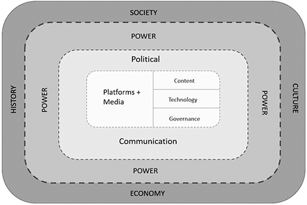

## Acknowledgement of Country

I would like to acknowledge the Traditional Owners of Australia and recognise their continuing connection to land, water and culture. The University of Sydney is located on the land of the Gadigal people of the Eora Nation. I pay my respects to their Elders, past and present.

## Last week {.smaller}

::: {.incremental}
- We opened the unit's running question: **does the massification of digital media strengthen or weaken democratic institutions and participation?**
- We defined **media, digital media, the Internet, social media, platforms, technologies** — and met the **hybrid media system** (old and new media interacting, not replacing each other).
- We met **affordances** — the possibilities for action a platform's architecture makes available to users.
- We also went quickly through the **social network revolution** and the shift from **social capital to Internet capital** — worth slowing down on, since we'll build on it today and return to it in full in **Week 8**.
:::

## Recap: what is a (digital) platform? {.smaller}

::: {.callout-note}
### Our Week 1 working definition

**(Digital) platforms** — digital infrastructures that **organise and curate** information, interactions, and transactions.
:::

::: {.incremental}
- Platforms are **infrastructures**, not just apps or websites — they sit underneath and structure how information, people, and exchanges flow.
- They **organise**: they don't just host content, they arrange and connect it — who sees what, who can reach whom.
- They **curate**: through algorithms and design, platforms make selective, ongoing decisions about what gets surfaced and what doesn't.
- They cover more than "information" — **transactions** are explicitly part of the definition too: buying, selling, booking, paying.
:::

::: {.callout-important}
### Not just social media
This definition is deliberately broader than "social media platform." Anything that organises and curates information, interactions, *or* transactions digitally can count — which is exactly what today's Mentimeter question is about.
:::

## In-class activity 1 {.smaller}

::: {.center}

**Quick poll — Mentimeter (open text / word cloud)**

:::

Given this definition — **digital infrastructures that organise and curate information, interactions, and transactions** — what digital platforms can you name?

::: {.callout-note}
Push past the obvious social media answers if you can — the definition doesn't require "social." Think about what else organises and curates information, interactions, or transactions in your daily life.
:::

## Recap: the social network revolution {.smaller}

::: {.columns}
::: {.column width="55%"}
Recall from Week 1: three revolutions, in **symbiosis** [@rainieNetworkedNewSocial2012] — the **Social Network Revolution** on one side, the **Social Media Revolution** and the **Mobile Revolution** together on the other. Always-on connectivity plus always-available devices are the technological engine; the social network revolution is the deeper shift in *how people are socially connected* that this engine enables and sustains.

That deeper shift is a move away from people being embedded in a small number of **tight-knit, durable groups** (family, neighbourhood, workplace) toward people operating as **networked individuals** — with **partial membership in many looser, more flexible networks** at once.
:::

::: {.column width="45%"}
::: {.callout-important}
### Strong ties vs. weak ties
**Strong ties** — durable, high-commitment bonds (family, close friends) — are what social capital networks are built from.

**Weak ties** — more numerous, lower-commitment, more flexible connections — are what digital platforms are especially good at creating and maintaining *at scale*.
:::
:::
:::

## Recap: social capital vs. Internet capital {.smaller}

::: {.columns}
::: {.column width="50%"}
**Social capital**

- Built from **strong ties**: dense, local, reciprocal
- Comes from **civic associations, parties, unions** — "legacy mobilization networks"
- Provides **connectedness** and a **sense of competence** — but access is geographically and demographically constrained
- An example of social capital is you. By being socially and geographically bounded together for some time you develop strong ties, which you can use from now on to facilitate other activities: finding a job, organise politically for a cause, get married, etc. 
:::

::: {.column width="50%"}
**Internet capital**

- Built from **weak ties**: platform-enabled, not geographically bound
- Lowers the barrier to organising — reaches people **outside** existing civic networks
- But lacks social capital's **cohesion and reciprocity** — needs an external push (e.g. legacy media attention) to sustain real mobilisation
- Example of Internet capital is [meetup.com](https://www.meetup.com/) (but also dating apps such as Tinder or online marketplaces such as Airtasker).
:::
:::

--- 

Today we add the political and institutional half of the Week 1 picture: **political communication** is not the same everywhere, and *where* it happens changes what platforms — and this new mix of strong and weak ties — actually do.

## Today's class {.smaller}

Definitions and Variations of Political Communication (Ch 2)

- Define **political communication** and explain why the textbook uses a deliberately expansive definition.
- Distinguish **institutionalised** political communicators from the "everyone is a potential political communicator" view.
- Compare how **political systems** (US vs. Switzerland) and **regime types** (democratic, hybrid, authoritarian) structure political communication differently.
- Apply the **politics–media–politics (PMP) model** to explain why platform effects are not the same everywhere.
- Connect this to today's case: does a "richer" digital+traditional media diet predict participation the same way in every political system?

## What makes communication *political*? {.smaller}

::: {.columns}
::: {.column width="60%"}
The textbook's definition is deliberately **expansive**: political communication is symbolic expression — spoken, written, visual, video, any combination — that concerns:

- the distribution of **power or resources**
- who counts as a **member of society**
- problems that need a **collective response**
- how we should **live together**, and by what values
- who **legitimately holds power**

Politics deals with **relations, power, identity, and decision-making** — not just elections and parliaments.
:::

::: {.column width="40%"}
::: {.callout-important}
### Private becomes political
Domestic violence, LGBTQIA+ rights, discrimination in housing — all were once "private" until communicative struggle made them public issues. What counts as private vs. public is *itself* a political fight.
:::
:::
:::

## Who communicates politically? {.smaller}

::: {.callout-note}
### Everyone — and something more specific
Anyone or anything whose expression relates to a matter of public concern is a potential political communicator: a citizen giving a press interview, a person coming out publicly, an entertainment show depicting immigrant life.
:::

But the textbook's real focus is **institutionalised political communicators** — actors who play **defined, patterned, routinised** roles over time:

- journalists, political parties, elected representatives
- press secretaries, political marketers, advocacy organisations
- **and now: platform companies and their algorithms.**

::: {.callout-important}
When Meta designs an algorithm to remove "racist" content, or Elon Musk publishes an "anti-woke" chat-bot [@screenshotElonMuskJust2024]  — that is political communication too, not just neutral infrastructure.
:::

## Media, genres, settings {.smaller}

Three concepts the textbook uses to explain *how* institutionalised political communication takes patterned shape:

- **Media** — not just the technology (a TV set), but the organisations, industries, and cultures built around it.
- **Genres** — patterned ways of communicating across media (a news broadcast format vs. an opinion column vs. a campaign rally speech).
- **Settings/contexts** — parliament vs. rally vs. legislative hearing vs. a Facebook post under your real name, where "**context collapse**" [@marwickTweetHonestlyTweet2011] makes work, family, and political ties visible all at once.

::: {.callout-tip}
Same person, same topic, different platform norms (anonymity, real-name policy, audience) → different political speech.
:::

## Case: the US vs. Switzerland {.smaller}

::: {.columns}
::: {.column width="50%"}
**United States**

- Presidential system, winner-takes-all
- Polarised two-party system, no power-sharing
- Electoral College concentrates campaigning in a few swing states
- Comparatively few regulations, huge resources at stake
- **Result:** strong incentive to innovate, spend, and go negative
:::

::: {.column width="50%"}
**Switzerland**

- Multi-party parliamentary system, power-sharing
- Federal Council: 7 members, consensus principle since 1891
- Sitting Council members are (by tradition) never voted out
- Elections rarely change who governs
- **Result:** few incentives to spend heavily or campaign aggressively — the real political action is in **referendum campaigns**
:::
:::

::: {.callout-important}
### Same wealthy, tech-savvy, Western democracy — completely different communication incentives
This is the textbook's core point: the *system* shapes the communication, before you even get to the platform.
:::

## Democracy is not binary {.smaller}

::: {.incremental}
- Most political communication research focuses on **liberal democracies** — but democracy is a matter of **degree**.
- Between "consolidated democracy" and "totalitarian state": **defective democracies**, **hybrid regimes/anocracies**, **democracies with adjectives**, democratic **backsliding**.
- Two cases already named in the chapter:
  - **6 January 2021** — an attempted coup in a long-consolidated US democracy, amid racial-justice backlash politics.
  - **India since 2019** — the world's most populous democracy experiencing backsliding under a Hindu-nationalist government.
:::

## Authoritarian regimes adapt, they don't just get swept away {.smaller}

::: {.callout-important}
### Against the early "Internet topples dictators" story
The Arab Spring narrative assumed platforms hand power to citizens by default. In practice, regimes **actively adapt** their survival strategies to the platform era — choosing whichever tool fits their capacity and context, not passively losing control.
:::

::: {.columns}
::: {.column width="33%"}
**Cut access**

Internet shutdowns during unrest — **DR Congo, Chad, Cameroon, Zimbabwe, Nepal** — a blunt, costly emergency measure, often denied by governments even as it happens.
:::

::: {.column width="33%"}
**Control content**

Sustained information control while staying connected — **Russia** (propaganda, manipulation), **China** (systematic filtering, domestic platform ecosystems) — "flood and filter" rather than switch off.
:::

::: {.column width="33%"}
**Ignore the pressure**

**Cameroon's Paul Biya**, in power since 1975 — the limit case: no amount of online mobilisation matters if a regime simply disregards electoral or constitutional norms and nothing enforces them.
:::
:::

::: {.callout-tip}
Three different mechanisms, one shared lesson: platforms don't determine political outcomes on their own — they're a terrain that both challengers **and** incumbents learn to use.
:::

## What was the Arab Spring? {.smaller}

::: {.callout-note}
### A wave of uprisings across the Arab world, starting December 2010
Anti-government protests and uprisings across North Africa and the Middle East, driven by grievances over authoritarian rule, corruption, unemployment, and repression.
:::

- **Tunisia, Dec 2010** — street vendor Mohamed Bouazizi's self-immolation after police harassment triggers protests that force President Ben Ali to flee within weeks.
- Spreads rapidly to **Egypt, Libya, Yemen, Syria, Bahrain** and beyond.
- **Egypt** — 18 days of protests in Tahrir Square force President Mubarak (in power since 1981) to resign, Feb 2011.
- **Very different outcomes by country**: Tunisia closest to a democratic transition; Egypt back to military-backed authoritarian rule; Libya, Syria, Yemen into prolonged civil war.

::: {.callout-tip}
[Watch: a short recap video](https://youtu.be/I3ZZWc8-1_o?si=4R5fPoZLNHW2M-7t)
:::

## Why platforms mattered {.smaller}

- Facebook and Twitter let people **organise, share footage, and coordinate** in real time — faster than state media could respond or censor.
- Recall **Internet capital**: platform-enabled, weak-tie connection, geographically unconstrained, reaching beyond any single organisation's network [@bailo2025breaking].
- But Internet capital alone rarely sustains mobilisation — it needs an external push.

::: {.callout-tip}
It took **international broadcasters** — Al Jazeera, CNN, BBC — covering the protests around the clock to turn scattered online activity into a mass movement.
:::

## ...and how far that went: validation and efficacy {.smaller}

::: {.callout-note}
### Validation
External confirmation — here, sustained global news coverage — that a cause or action is significant and real, not fringe or containable.
:::

::: {.callout-note}
### Political efficacy
The belief that participation can actually make a difference. Seeing your protest on Al Jazeera or CNN, alongside thousands doing the same, raises **collective efficacy** — the sense that *together, it might actually work*.
:::

::: {.callout-important}
Internet capital for speed and reach, legacy media for validation and efficacy — the same two-step mechanism Week 8 examines in full for the Five Star Movement.
:::

## Platforms are not equally "democratising" everywhere {.smaller}

::: {.columns}
::: {.column width="55%"}
- Early **Arab Spring** optimism (Internet → democracy) has given way to a more sceptical view.
- Same platform, opposite use: **mobilising tool** for movements *and* a **surveillance/propaganda tool** for the regimes they challenge.
- Digitally enabled mobilisation does **not automatically** translate into the durable institutions democratic change actually needs [@chadwickHybridMediaSystem2013 — recall the hybrid media system from Week 1: old institutional power doesn't just disappear].
:::

::: {.column width="45%"}
::: {.callout-tip}
### The politics–media–politics (PMP) model
Political structures shape media use → media use shapes politics → which reshapes the political structures political actors operate in next. A loop, not a one-way effect.
:::
:::
:::

## In-class activity 2 {.smaller}

::: {.center}

**Quick reflection — Mentimeter (open text)**

:::

Think of an internet-fuelled protest or movement you remember (Arab Spring or otherwise — anywhere in the world).

**Was it sustained? Did it actually change something?**

## Case study: political information repertoires {.smaller}

Wolfsfeld, Yarchi & Samuel-Azran [-@wolfsfeldPoliticalInformationRepertoires2016] ask: does combining **traditional and social media** predict political participation better than relying on either alone?

Surveyed **1,125 Israeli internet users**, one week before the January 2013 election. Measured how much each respondent used **traditional media** (TV news, newspapers, radio) and **social media** (Facebook, Twitter) specifically *for political information* — two separate scales, not one media-use scale.

::: {.callout-important}
### Why "repertoire," not just "media use"
A **political information repertoire** is the specific *combination* of sources someone relies on to keep up with politics. The claim isn't "more media = more participation" — it's that *which combination* you use matters, and that traditional and social media do different, complementary jobs rather than substituting for each other.
:::

## The four ideal types {.smaller}

Respondents are split into four types, based on whether they score **high or low** on each of the two scales (traditional media use for politics; social media use for politics):

::: {.columns}
::: {.column width="50%"}
- **Avoiders** — low on *both* traditional and social media. Not engaged with political information through either channel.
- **Traditionalists** — high on traditional media, low on social. The classic "reads the newspaper, watches the news" citizen — but doesn't discuss politics on Facebook/Twitter.
:::

::: {.column width="50%"}
- **Socials** — high on social media, low on traditional. Gets political information mainly through friends' posts and social feeds, not TV or newspapers.
- **Eclectics** — high on *both*. Actively combines traditional and social media to track politics — the "richest" repertoire.
:::
:::

::: {.callout-tip}
### Why this typology, not a single "amount of media use" score
Two people can use the *same total amount* of media and land in completely different types — a Traditionalist and a Social both use "some" media, but the **mix** predicts different outcomes, which a single combined score would hide.
:::

## The core claim {.smaller}

::: {.callout-important}
### Prediction
**Eclectics** should show the highest political interest, knowledge, efficacy, and participation. **Avoiders** the lowest. **Traditionalists** and **Socials** should fall in between.
:::

- The logic: political **interest** drives people to build a richer repertoire in the first place (motivated citizens seek out *more* sources, of *more* types).
- A richer repertoire then builds political **knowledge** and **efficacy** (the sense that participating is worth it) — because traditional and social media each expose people to different information and different social pressure to act.
- Knowledge + efficacy together predict **participation** — both online (signing petitions, posting) and offline (protests, meetings).

Not "digital vs. traditional" — the claim is that **combining** both outperforms relying on either alone.

## What the data actually showed {.smaller}

| Group | Political interest | Digital participation | Traditional participation |
|---|:-:|:-:|:-:|
| Avoiders | 4.60 (lowest) | 1.46 (lowest) | 1.39 (lowest) |
| Traditionalists | 6.90 | 1.64 | 1.66 |
| Socials | 6.26 | 2.36 | 1.70 |
| **Eclectics** | **7.56 (highest)** | **2.75 (highest)** | **2.00 (highest)** |

::: {.callout-tip}
### Against "slacktivism"
Social media exposure predicted *more* traditional (offline) participation, not less — the study is a direct empirical rejection of the "slacktivism" thesis (Gladwell, Morozov) that digital activism substitutes for real-world action.
:::

One exception worth noting: **Traditionalists**, not Eclectics, scored *highest* on political **knowledge** — reliance on traditional media still matters distinctly for general political knowledge, even if social media wins on mobilisation.

## Does this still hold? More recent, comparative evidence {.smaller}

Wolfsfeld et al. is one country (Israel), one election (2013). Vaccari & Valeriani [-@vaccariOutsideBubbleSocial2021] test a related question with much broader, more recent evidence: **nine Western democracies**, surveyed **2015–2018**.

::: {.callout-important}
### Key findings — social media as a participation catalyst
Specific political *experiences* on social media are positively associated with participation:

- Engaging with content that **reinforces your own views**
- Being **targeted by electoral mobilisation** (e.g. a campaign ad or reminder to vote)
- **Accidentally** encountering political news you weren't looking for
:::

- **Accidental exposure works — and it's an equalizer.** Its effect on participation is smaller than direct mobilisation, but it matters *most* for people who don't already seek out news: "political junkies" gain little from stumbling on politics online, while less-engaged citizens see a real participation boost.
- **Against the "filter bubble" thesis.** Most users are *not* trapped in echo chambers — most people's social media feeds routinely mix content they agree and disagree with.

## Where the evidence comes from {.smaller}

::: {.columns}
::: {.column width="50%"}
- **Nine countries**: Denmark, France, Germany, Greece, Italy, Poland, Spain, the UK, the US.
- **Custom online surveys**, representative of each country's internet-using population.
- Fielded **immediately after a national election**, June 2015 – March 2018 — capturing participation at its most likely peak.
:::

::: {.column width="50%"}
- **Participation measured as an index** of six activities in the past year: contacting politicians, signing petitions, donating to campaigns, attending rallies, leafleting, persuading others to vote.
- **Coarsened Exact Matching (CEM)** used to balance who did/didn't have each social media experience — a more rigorous causal design than a single cross-sectional survey.
:::
:::

::: {.callout-tip}
Same basic story as Wolfsfeld — social media use is linked to more participation, not less — but now backed by nine countries, three years, and a design built specifically to rule out the obvious confound: that politically engaged people would participate more *regardless* of what happens on social media.
:::

## In-class activity 3 {.smaller}

::: {.center}

**Quick poll — Mentimeter**

:::

Think about your own information habits during the last election you followed (in Australia or elsewhere).

**Which type are you: Avoider, Traditionalist, Social, or Eclectic?**

We'll look at the class distribution together — and ask whether it lines up with what the study predicts about participation.

## Does the finding travel? {.smaller}

Wolfsfeld is **single-country, single-election, cross-sectional** — Israel, January 2013. Vaccari & Valeriani strengthen the case considerably: nine countries, three years, a stronger causal design. But even nine countries is not everywhere.

::: {.incremental}
- All nine of Vaccari & Valeriani's countries are **Western, wealthy, multi-party or two-party electoral democracies** — none is a consensus system as extreme as Switzerland, and none is authoritarian or backsliding.
- Recall the **US vs. Switzerland** contrast from earlier: even within "Western democracy," Israel's and the US's competitive, high-stakes elections look different from Switzerland's low-incentive, consensus system — would the finding hold there too?
- Would it hold in **backsliding India**, where the very right to safely combine online and offline dissent is under pressure?
- This is exactly the textbook's point: a mechanism found even across nine countries is not automatically portable everywhere — **political communication is context-dependent all the way down**, even at the level of "does using more media make you more politically active."
:::

## Week 02 Quiz

Head to Canvas to complete the Quiz or complete it by the end of the week.

## Building the model: platforms embedded in systems {.smaller}

::: {.columns}
::: {.column width="45%"}
The chapter's model: platforms sit at the **core** of political communication, but they are always **embedded** in:

- **media systems** (commercial concentration, public broadcasting, pluralism)
- **political systems** (regime type, party system, electoral rules)
- broader **historical, social, cultural, economic** forces

::: {.callout-important}
### Power runs both ways
Context shapes platforms (e.g. Germany's hate-speech laws, rooted in its Nazi past) — **and** platforms shape context (what citizens know, how they mobilise, who gains visibility).
:::
:::

::: {.column width="55%"}
{width="100%"}
:::
:::

::: {.footer}
Klinger, Kreiss & Mutsvairo (2023), Ch 2, Figure 1: *A model of political communication in the digital age.*
:::

## Where this connects forward {.smaller}

::: {.incremental}
- **Week 3** — platform power and algorithmic gatekeeping: our first "leg" of the running verdict. If platforms are embedded in systems, how much power do platforms themselves actually hold?
- **Week 7** — campaigns and the participation paradox: today's Eclectics/Avoiders typology returns when we ask whether lowering the cost of participation helps or reinforces existing inequality.
- **Week 13** — the running verdict returns to exactly this chapter's insight: platform effects are never uniform, they're always filtered through the political system they land in.
:::

## Key takeaways {.smaller}

- Political communication is deliberately defined **expansively** — anything concerning power, resources, identity, or how we should live together.
- **Institutionalised** political communicators (including platforms and their algorithms) play patterned, routinised roles.
- The **same platforms** produce different political effects depending on the **political system** they're embedded in (US vs. Switzerland; consolidated vs. backsliding democracies; authoritarian adaptation).
- The **politics–media–politics model**: political systems shape media use, which shapes politics, in a loop.
- Empirically, **combining** traditional and social media ("Eclectics") predicts the highest political participation — but even this finding is itself a product of the political system it was measured in (Israel, 2013).

## {.center}

# Attendance

Get your phone out again!

## {.center}

# Any quick question?

## {.center}

# See you next week!

## References
