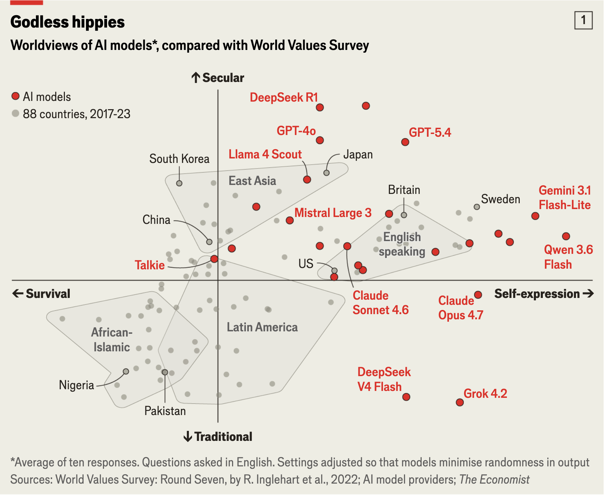
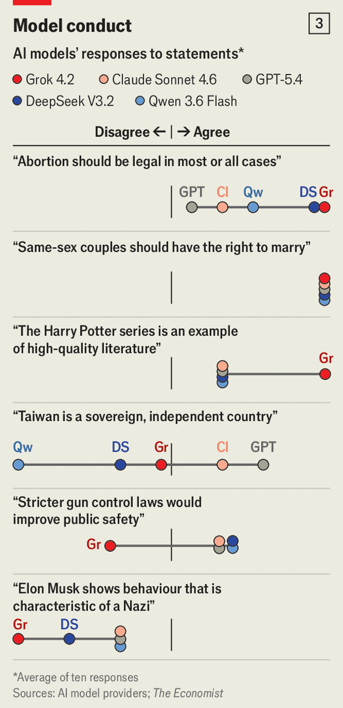

## Acknowledgement of Country

I would like to acknowledge the Traditional Owners of Australia and recognise their continuing connection to land, water and culture. The University of Sydney is located on the land of the Gadigal people of the Eora Nation. I pay my respects to their Elders, past and present.

## Last week {.smaller}

::: {.incremental}
- We defined **political communication** expansively — symbolic expression concerning power, resources, membership, collective problems, and legitimate authority — and met **institutionalised political communicators**, including platforms and their algorithms.
- **Political systems** structure political communication before platforms even enter the picture: US vs. Switzerland, consolidated vs. backsliding democracies, and authoritarian regimes that *adapt* rather than lose control.
- Empirically, **combining** traditional and social media ("Eclectics") predicted the highest political participation — but even that finding was itself a product of the political system it was measured in.
:::

## Today's running question {.smaller}

::: {.callout-important}
### Leg 1 of the semester's verdict
Does digital media strengthen or weaken democratic institutions? Today we test this by asking: **who actually holds power over political communication once platforms sit at its centre — and can we even see them exercising it?**
:::

Today's class (Ch 3):

- Define **platforms** and see why the definition is harder than it looks.
- Unpack the **six dimensions of platform power** — market, distributional/attention, intermediary, content, economic, technological.
- Establish why platforms are **not neutral technologies**, however "open" their interface looks.
- Read Soffer's [-@sofferAlgorithmicPersonalizationTwoStep2021] argument that **algorithms have replaced opinion leaders as gatekeepers** — and ask what changes when the gatekeeper is invisible.
- Apply it to a concrete case: Facebook's 2018 news feed change and Australian journalism.

## In-class activity 1 {.smaller}

::: {.center}

**Quick poll — Mentimeter (multiple choice)**

:::

Think about the last time your social media feed showed you something political. Who — or what — do you think was *most* responsible for that choice?

- A friend or contact who shared/liked it
- The platform's ranking algorithm
- The publisher/creator, by posting it at all
- You, through your own search or settings
- Honestly, no idea

## What is a platform, really? {.smaller}

::: {.columns}
::: {.column width="55%"}
We casually say "platform" for Google search, a Facebook post, an Amazon purchase — but what makes these the *same kind of thing*? The textbook's definition, from van Dijck, Poell & de Waal [-@vandijckPlatformSociety2018]:

> A platform is fuelled by **data**, automated and organised through **algorithms and interfaces**, formalised through **ownership relations** driven by **business models**, and governed through **user agreements**.
:::

::: {.column width="45%"}
::: {.callout-important}
### Five components, one architecture
**Data** → **algorithms** → **interfaces** → **business models** → **governance** (user agreements). Every platform — Facebook, Google, Amazon, Spotify, OpenAI — is built from the same five ingredients, combined differently.
:::
:::
:::

## A harder definition: Bratton's *The Stack* {.smaller}

::: {.columns}
::: {.column width="55%"}
Bratton [-@brattonStack2016] offers a denser, more technical definition than van Dijck, Poell & de Waal — worth sitting with slowly:

> A platform may be defined as a standards-based technical-economic system that may simultaneously distribute interfaces into that system through their remote coordination and centralizes their integrated control through that same coordination. [@brattonStack2016, p. 374]
:::

::: {.column width="45%"}
::: {.callout-important}
### Unpacking it
- **Standards-based** — everyone plugs in via the same rules (APIs, protocols).
- **Distributes interfaces** — the platform *extends outward*, putting an endpoint in front of every user, developer, advertiser.
- **Centralizes control** — but that same coordination pulls power *back* to one point.
:::
:::
:::

::: {.callout-tip}
Bratton's paradox in one line: **the more a platform spreads out, the more it pulls power in.** Distribution and centralisation aren't opposites here — they're the same mechanism, seen from two ends.
:::

## Platforms organise interactions, they don't just host content {.smaller}

::: {.callout-note}
### Meta or OpenAI don't do journalism
They don't produce news or decide what stories exist — but they decide *how visible* each story is, via a newsfeed algorithm optimised to keep you scrolling (which is how Facebook monetises attention) or the internel weighting of their Large Language Models (LLM).
:::

::: {.callout-note}
### Google doesn't own the web
Google doesn't maintain the pages it links to — but its "PageRank" and related algorithms decide which pages billions of people ever find. Whoever writes the ranking rules shapes how the entire web is navigated [@nobleAlgorithmsOppressionHow2018].
:::

Same underlying move in both cases: the platform isn't a passive pipe, it's an active organiser of who sees what.

## Recap: the social network revolution, and Internet capital {.smaller}

::: {.callout-tip}
Recall from Week 1: the shift from durable, strong-tie groups toward **networked individuals** with many loose, weak-tie connections. **Internet capital** — platform-enabled, weak-tie, not geographically bound — lowers the barrier to organising outside existing civic networks, but lacks the cohesion and reciprocity of **social capital**.
:::

Today's question sharpens that: if platforms mediate the weak ties that increasingly carry political communication, then whoever designs the platform's algorithm has a new kind of power over that mediation — power that didn't exist when mediation ran through people you actually knew.

## Platforms are not neutral technologies {.smaller}

::: {.columns}
::: {.column width="50%"}
Even a football pitch — apparently the most neutral possible technology — isn't neutral: turf type, pitch size, and which foot you favour all create structural advantages before a ball is kicked.
:::

::: {.column width="50%"}
Facebook's feed algorithm is far less neutral than a football pitch: it **rewards emotion and engagement**, not reason or deliberation [@bucher2021]. What gets attention is shaped by recency, network structure, emotional content, and — crucially — *what already performed well*, compounding advantage over time.
:::
:::

::: {.callout-important}
### Design choices are social choices
Ranking rules, character limits, what counts as "friends" — none of this is a neutral technical fact. It reflects the intentions, business model, and worldview of whoever built it [@gillespie2014].
:::

## What about AI platforms? {.smaller}

::: {.callout-note}
### Too early to say
Everything so far — ranking algorithms, feed design, moderation rules — describes platforms as we've known them for over a decade. Generative AI systems (ChatGPT, Claude, Gemini, DeepSeek) are also platforms by the definitions we've just seen, but it is **still too early to know** how their design or internal architecture will shape what content they select and present to us. The mechanism is different — not a ranked list of others' content, but a single generated answer — and its politics are only starting to be documented.
:::

One early data point, from *The Economist* [-@economistAIModelsValues2026]: when researchers systematically compared AI models' stated positions on contested political and social questions, the models didn't cluster near ordinary people's views — and different models disagreed sharply with *each other*, splitting in part along the lines of which country trained them.

---

::: {.columns}
::: {.column width="60%"}
{width="85%"}
:::

::: {.column width="40%"}
{width="55%"}
:::
:::

::: {.callout-tip}
If Gillespie is right that design choices are social choices, the open question for AI platforms is: **whose social choices, exactly** — and how would we even detect them, given we can't inspect a ranking algorithm the way we once could?
:::

## In-class activity 2 {.smaller}

::: {.center}

**Quick reflection — Mentimeter (open text)**

:::

Look again at the chart: different AI models land in very different places on secular/traditional and survival/self-expression.

**How do you think a company gets its model to land in a particular spot — and how would you go about controlling a model so it isn't racist, or isn't anti-abortion?**

## The six dimensions of platform power (according to the textbook) {.smaller}

| Dimension | What it means |
|---|---|
| **Market power** | Concentration of advertising/data markets among a few firms (Meta, Google, Amazon) |
| **Distributional & attention power** | Control over what political content reaches whom, and how much attention it gets |
| **Intermediary power** | Structuring how *any* two actors interact — not just gatekeeping content, but organising the relationship itself |
| **Content power** | Setting and enforcing content moderation rules — deciding what counts as acceptable speech |
| **Economic power** | Capital concentration distorting labour markets, competition, pricing |
| **Technological power** | Algorithms as automated decision-makers, shaping visibility and reach |

## From six dimensions to four forms of communication power {.smaller}

::: {.callout-note}
### A sharper toolkit
The textbook's six dimensions describe *what* platforms control. Castells [-@castellsCommunicationPower2009] asks a more specific question about **communication power**: within a network, *who* holds it — the platform itself, an organisation's leadership, or its grassroots members?
:::

Castells identifies four forms: **network-making power** (shaping a network's structure and reach), **networked power** (direct communicative influence within it), **networking power** (control over who's let in), and **network power** (setting the rules of interaction).

::: {.callout-important}
### Our own research
Marolla, Miotto, Cassani & Bailo [-@marolla2025affording] adapt this typology to ask how communication power is actually distributed once a political organisation goes digital — using the Five Star Movement's five-platform ecosystem as the case.
:::

## Communication power in platformed political organisations {.smaller}

::: {style="font-size: 0.75em;"}
| Form of power | Digital platforms | Leadership | Grassroots |
|---|---|---|---|
| **Network-making** (capacity to shape network structure and reach) | *Instrumentarian power* [@zuboffAgeSurveillanceCapitalism2018]: shapes behaviour via algorithms/data | *Collective action*: mobilise followers top-down | *Connective action*: coordinate horizontally |
| **Networked** (direct communicative power within networks) | *Curation power* [@gillespie2014]: filter, amplify, suppress content | *Centripetal power*: consolidate, centralise control | *Centrifugal power*: decentralise, diversify interaction |
| **Networking** & **Network** (control over network access and standards) | *System admin. power* [@brattonStack2016]: exclusive control over rules, access, moderation | surrendered to platforms | surrendered to platforms |
:::

::: {.callout-tip}
When a movement moves its internal life onto platforms, it doesn't just gain new tools — it hands **networking and network power** entirely to the platform owner. Leadership and grassroots are left contesting only what remains: network-making and networked power.
:::

::: {.callout-note}
We'll come back to this — and to Internet capital's role in bypassing institutions entirely — in **Week 8**.
:::

## In-class activity 3 {.smaller}

::: {.center}

**Quick poll — Mentimeter (multiple choice)**

:::

Think of a WhatsApp/Instagram group you use to organise something political or semi-political (a uni society, a protest, a petition).

**Which cell of this table best describes *your* power in that group?**

- Network-making — I could shape how the group itself works
- Networked — I could get my message seen/heard within it
- Networking/Network — none of this, the app's owner decides all of it
- Honestly, I've never thought about it this way

## Case: Facebook's 2018 algorithm change {.smaller}

::: {.callout-note}
### What happened
In January 2018, Facebook changed its News Feed algorithm to prioritise "meaningful social interactions" (posts from friends and family) over public content from Pages — including news publishers. [Link to story](https://youtu.be/TA4Wr4QVTDk?si=jAS52cKNYdNYpQFK)
:::

Bailo et al. [-@bailoNewsMediaFacebook2021] tracked Australian news outlets' Facebook engagement before and after the change.

## Case: what the data showed {.smaller}

- **Overall decline** in news visibility and Facebook-referred traffic to Australian news sites.
- **Social/native news outlets** (e.g. BuzzFeed-style, share-driven content) hit hardest — their whole model depended on Facebook's prior ranking logic.
- **Public service media** (ABC, SBS) proved comparatively resilient — high public trust and a non-commercial audience relationship mattered when the algorithm shifted underneath everyone at once.

::: {.callout-important}
One line of code, decided inside Facebook, restructured which Australian news organisations could reach their audiences — with no public debate, warning, or accountability mechanism.
:::

## Reading: algorithms as the new opinion leaders {.smaller}

Soffer [-@sofferAlgorithmicPersonalizationTwoStep2021] returns to a classic mass-communication theory to make sense of exactly this kind of invisible power shift.

::: {.callout-tip}
### The two-step flow of communication (Katz & Lazarsfeld, 1955)
Mass media content doesn't reach the public directly. It flows first to **opinion leaders** — socially embedded, trusted people — who interpret and pass it on to their peer group. The group, not the isolated individual, is the real unit of media effect.
:::

Soffer's move: in the platform era, **algorithms perform the second step**. They take generic content and personalise it to an individual — the same function opinion leaders once served, but automated.

## Comparing the two eras {.smaller}

| | Original two-step flow | Algorithmic two-step |
|---|---|---|
| **Personalisation** | Opinion leader frames content for their group | Algorithm matches content to a user via computation |
| **Social setting** | Interpersonal relationships | Individual + digital device |
| **Timing** | Two separate events, possibly delayed | Simultaneous, instantaneous |
| **Gatekeeper's authority** | Expertise, social standing | "Neutral," mathematical — but isn't |
| **The "peer group"** | Solid: family, friends, co-workers | Liquid: a data-derived cluster, constantly recalculated |
| **User awareness** | High — you know who your opinion leader is | Often none — the algorithm runs invisibly |

::: {.callout-important}
That last row is the crux of Soffer's argument: you could always ask your opinion leader *why* they thought something mattered. You cannot ask Facebook's ranking algorithm the same question.
:::

## Why "personalisation" is the wrong word {.smaller}

::: {.callout-important}
### Soffer's critique
Calling algorithmic curation "personalisation" borrows the language of interpersonal relationships — as if the platform *knows* you the way a friend does. This humanises a computational, profit-driven process and obscures the power relationship behind it [@marcuse1964].
:::

- Algorithms don't know your actual interests — they infer a **calculated, constantly shifting cluster** you've been sorted into, based on behaviour, location, and data inputs.
- Unlike a human opinion leader, whose authority you could question or discount, an algorithm's authority comes from an **aura of mathematical neutrality** — even though it reflects the commercial and design choices of whoever built it.
- The old two-step flow was criticised for ignoring horizontal, peer-to-peer flows of opinion. The algorithmic version doesn't fix that — it often **replaces peer discussion entirely** with direct platform-to-individual delivery.

::: {.callout-note}
- Yet, Soffer doesn't provide a satisfactory explanation for the role of **influencers** (we will come back to political influencers in Week 12). A more realistic model is probably a platforms' algorithms $\times$ influencers model.
:::

## Connecting the case and the theory {.smaller}

::: {.incremental}
- The Facebook 2018 change is **exactly** Soffer's "algorithmic two-step" in action: one design decision, invisible to users, instantly reshaped which content — and which publishers — reached which audiences.
- No opinion leader was involved, no one could ask *why* their feed changed, and there was no equivalent of interpersonal discussion to soften or contest the shift.
- ABC/SBS's resilience shows the old, "solid" social structures (public trust built over decades) still mattered — but they mattered *despite* the algorithm, not because users could negotiate with it.
- This is **Leg 1** of the semester's argument: platforms hold real, structural power over political communication, and a defining feature of that power is that it is largely **unaccountable and hard to see** — which is a different kind of problem than power that is visible and can be publicly contested.
:::

## Where this connects forward {.smaller}

::: {.incremental}
- **Week 5** — platforms and journalism: today's case *is* Week 05's topic from the publisher's side — how journalism institutionally responds to algorithmic gatekeeping.
- **Week 7** — the participation paradox: does algorithmic curation equalise political exposure, or reinforce who already pays attention?
- **Week 9** — platform governance: if algorithmic power is invisible and unaccountable, can regulation (DSA/DMA, oversight boards) restore some of what journalists and opinion leaders used to provide?
- **Week 13** — the running verdict returns to ask whether this kind of power is compatible with democratic accountability at all.
:::

## Key takeaways {.smaller}

- A **platform** is data + algorithms + interfaces + business model + governance — organising interactions, not just hosting content.
- Platforms hold power across **six dimensions** — market, distributional/attention, intermediary, content, economic, technological.
- Platforms are **not neutral**: design and ranking choices reflect commercial interests and embedded values, even when they look open to everyone equally.
- Soffer reframes algorithms as **the new opinion leaders** — performing the two-step flow's personalising function, but invisibly, without the social accountability a human opinion leader had.
- Facebook's 2018 news feed change shows this isn't abstract: one algorithmic decision reshaped Australian journalism's reach overnight, with no public debate.

## In-class activity 4 {.smaller}

::: {.center}

**Quick poll — Mentimeter (multiple choice)**

:::

**Have you ever received political information or content from a chatbot (ChatGPT, Claude, Gemini, etc.)?**

- Yes, because I asked for it
- Yes, but I didn't ask for it
- No, never
- Not sure / can't tell

## In-class activity 4, continued {.smaller}

::: {.center}

**Short answer — Mentimeter (open text)**

:::

Everything today — platform power, the six dimensions, Castells, Soffer's algorithmic two-step — was built to analyse platforms like Facebook, Google, and TikTok.

**Should we consider chatbots as traditional digital platforms, as we try to understand their impact on political communication? Or do they need a different framework?**

## In-class quiz! {.smaller}

::: {.center}

In-class tasks during lectures are not assessed, but participation is timestamped and recorded.

:::

## {.center}

# Attendance

Get your phone out again!

## {.center}

# Any quick question?

## {.center}

# See you next week!

## References
