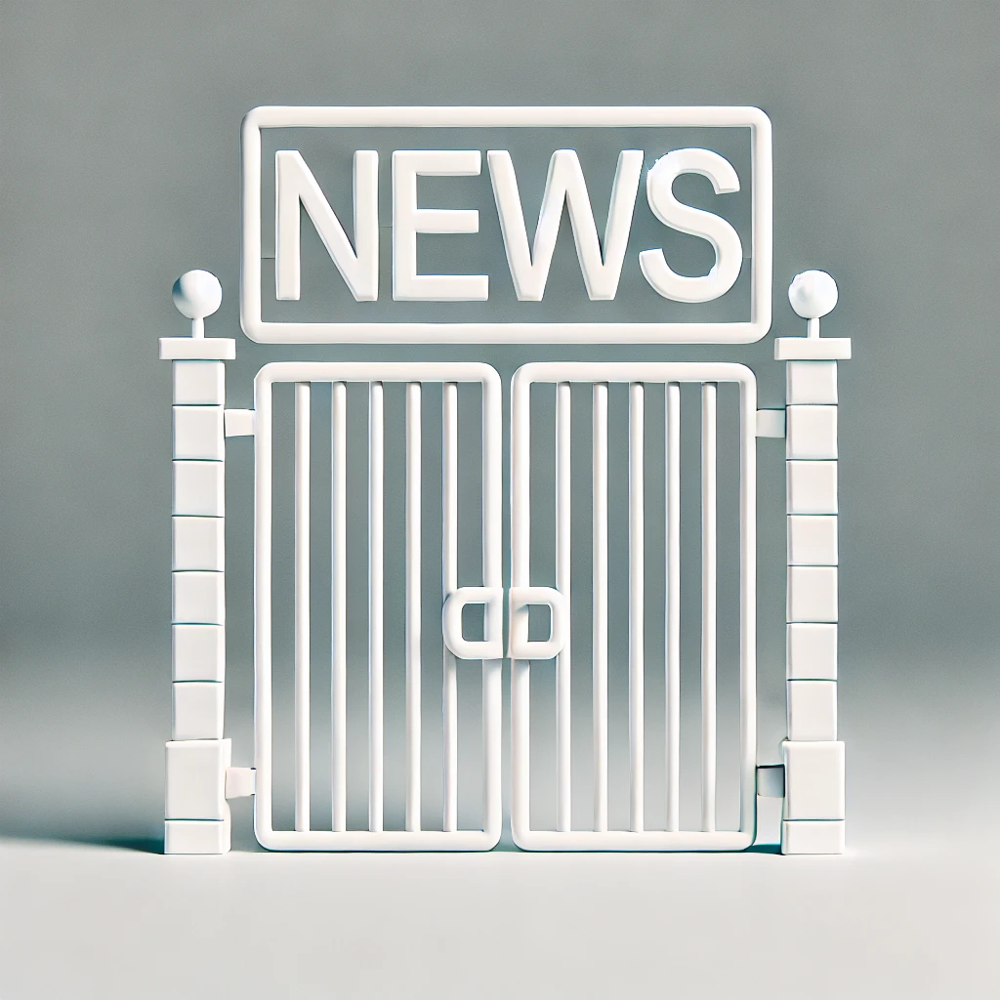

background-image: url(https://upload.wikimedia.org/wikipedia/en/6/6a/Logo_of_the_University_of_Sydney.svg)
background-size: 95%

```{r setup, include=FALSE}

knitr::opts_chunk$set(echo = TRUE, message = FALSE, warning = FALSE, 
                      dev = 'svg', out.width = "45%", fig.width = 6,
                      fig.align="center")

```

## Acknowledgement of Country

I would like to acknowledge the Traditional Owners of Australia and  recognise their continuing connection to land, water and culture. The  University of Sydney is located on the land of the Gadigal people  of the Eora Nation. I pay my respects to their Elders, past and present.


---

.content-box-green[

**Note** When not otherwise referenced, materials are based on and adapted from from Klinger, U., Kreiss, D., & Mutsvairo, B. (2023). *Platforms, power, and politics: An introduction to political communication in the digital age*. Polity.

]


---
class: segue-red

# Introduction  

---

## Journalism as a Dangerous Profession  
> *"Journalism is a dangerous profession."*  

- Global risks: Mexico, Chile, Palestine  

> *"In many contemporary societies, journalism is considered dangerous because it is impossible to separate it from politics."*  

- Authoritarian regimes target journalists  

- Press freedom is fragile even in democracies  

---

## Journalism’s Political Nature  
> *"Journalism is inherently political."*  

- Pursuit of truth = confronting power  
- Journalists make choices about coverage  
- Watchdog role central to democratic accountability  
- Different political systems = different journalism cultures  

---

## Journalism Cultures and Power  
> *"Journalistic practices shape relationships between media and political actors."*  

- Watchdog cultures maintain distance from politics  
- State-aligned journalism limits democratic discourse (e.g., Russia)  
- Platforms reshape political communication cultures globally  

---
class: segue-red
## What Is Journalism?  

---

## Defining Journalism – Professional and Citizen  
> *"At the core, journalism is about the pursuit of truth through the gathering, selection, and presentation of news."*  

- Greste’s 4 Ps: 
  - **P**erson, 
  - **P**roduct, 
  - **P**urpose, 
  - **P**rocess  
- Citizen journalism and participatory journalism rising  
- Example: Ukraine citizen reporting during the war  

---

## Telling Truth and the Complexity of Facts  
> *"A core question for journalism... is: whose truth? And what constitutes truth?"*  

- Competing claims during elections (Trump, Congo)  
- Journalists face ethical decisions daily  
- Press freedom rankings reveal global disparities  
- Spotlight case: Russia’s law punishing ‘false’ war reporting  

.center[
</img>
]
*Dmitry Ivanov was sentenced to 8.5 years in prison under Russia's fake news law in March 2023. (Source: Wikipedia)*

---

## Journalism Under Threat  
> *"1,668 journalists have been killed worldwide between 2003 and 2022."* (Reporters Without Borders' figures) 

- Belarus crackdown post-election (2020)  
- Lukashenko's regime forcing a Ryanair landing to arrest a journalist  
- The global war on truth-tellers  

.center[]

---
class: segue-red
# Journalism and Its Connections to Politics  

---

## Journalism’s Role in Democracy  
> *"Journalism is a precondition for democratic governing."*  

### Why Journalism is Essential for Democracy:
- **Provides reliable information** citizens need to make political decisions
- **Aggregates public voices** and social grievances, reflecting them back to society
- **Enables public deliberation** by informing debates, policy priorities, and elections
- **Serves as a watchdog** over power, holding government, corporations, and elites accountable
- Without journalism:  
  - *"It is hard for a society to know itself in an immediate way."*  
  - Citizens struggle to prioritise policy agendas or solve problems collectively 
  
.content-box-red[ 
According to Habermas, journalism (independent from market logics) is essential for the functioning of the public sphere.
]


---

## Journalism’s Three Core Political Functions  
### 1. Gatekeeping  
> *"Journalists reduce the amount of information pouring into public consciousness every day."* 

.pull-left[

.center[]

.small[
> *"Gatekeeping describes the powerful process through which events are covered by the mass media, explaining how and why certain information either passes through gates or is closed off from media attention."* (Shoemaker & Vos 2009)
]
]

.pull-right[

### What is Gatekeeping?
- Journalists act as **filters**, deciding what information reaches the public  
- They **select, prioritise, and reject** stories based on news values, time, and space limits  
- Goal: **"Keep the junk, nonsense, and 'bullshit' out" (Frankfurt 2009)**  


.footnote[Shoemaker, P. J. & Vos, T. (2009) *Gatekeeping Theory*. Routledge.]

]

---

## The Rise of **Networked Gatekeeping**  
### Platforms Change Who Controls the Gate
> *"In the platform era, there are many more actors involved in gatekeeping – including trusted but non-institutional curators of news and information on social media."*  

- **Influencers, activists, bloggers, and citizen journalists** now shape what information circulates
- Example: **Trending Twitter topics** push stories into mainstream news agendas
- **"Gatewatching"** (Bruns 2005/2018): online users monitor, amplify, or challenge professional media content

.footnote[
Bruns, A. (2005) *Gatewatching: Collaborative Online News Production*. Peter Lang.
]

---

## Why It Matters
- Traditional journalists have lost **exclusive control** over information flows
- Publics now exposed to **multiple gatekeepers** shaping **diverse, fragmented, and sometimes conflicting agendas**
- Example: **Teenagers on TikTok reaching larger audiences than newsrooms**
- Networked gatekeeping affects:
  - What becomes news
  - **How quickly stories spread**
  - **Whose voices dominate public debates**

---

## Agenda Setting and Framing  
### 2. Agenda Setting  
> *"The more coverage an issue receives, the more important it is to people."*  

- Transferring salience from media to politics  
- Social media enables grassroots agenda-setting  

### 3. Framing  
> *"Frames define problems, diagnose causes, make moral judgements, and suggest remedies."*  

- Example: Protesters as activists or troublemakers  

---

## Platforms Shift the Power  
> *"Teenagers streaming TikTok videos... can have larger audiences than journalists."*  

### The Erosion of Journalism’s Exclusive Gatekeeping Power (but also agenda setting and framing)
- Platforms like **TikTok, YouTube, Twitter/X, Facebook** have **transformed media ecosystems**
- Anyone — **activists, influencers, politicians, or ordinary users** — can now:
  - Publish content
  - Reach large audiences instantly
  - Set the news agenda

> *"Journalists are not alone anymore in selecting information and making decisions about how often and with what frames they report about them."*


---
class: segue-red

# Journalists’ Relationship to Their Publics  

---


## Public Trust, Knowledge, and Platform Dynamics  
> *"Journalism faces a number of crises in their relationships with publics across the world."*

### Journalism’s Crisis of Trust and Confidence
- Even in democracies with strong press protections, journalism faces:
  1. **Economic challenges**
  2. **Falling public confidence**
  3. **Growing political attacks on journalists**

> *"Declines in public confidence and trust... are related in part to shifts in media and technology."*

---

## Why Is Public Trust Eroding? (Although not everywhere...)
- Digitisation and platforms changed the **rules of journalism**:
  - **Click-driven content** incentivised sensationalism and clickbait

> *"User-generated content sits alongside citizen journalism, meaning that sources of information are harder to determine for publics."*

- Audiences overwhelmed by **information abundance** and **"news finds me"** habits

.content-box-yellow[

And yet...

- Some Global South regions (India, parts of Africa) report **strong journalism resilience**
- Crises are **not universal** — they differ by context

]


---

## Clickbait Media and Public Trust

> *"Social media simultaneously serves as a distribution platform and reputation builder, as social recommendations take the place of expensive investments in high-quality journalism."*  

### The Rise of Clickbait Media
- Social media transforms news distribution and trust-building
- **"Credibility cascades"**: stories gain credibility *as they are shared* — not because of journalistic quality
- Low-cost, fast-entry digital markets encourage **"hit-and-run" content production**
- News producers increasingly focus on **engagement metrics** (likes, shares) rather than verification
- **"Clickbait" headlines** optimise emotional reaction and virality over substance

.footnote[Munger, K. (2020). All the News That’s Fit to Click: The Economics of Clickbait Media. *Political Communication*, 37(3), 376–397. https://doi.org/10.1080/10584609.2019.1687626]

---

## Clickbait Media and Public Trust
### Implications for Journalism and Democracy
- Platforms like **Facebook incentivise low-cost content**, undermining traditional journalism
- Example: **Upworthy’s rise and fall**—rapid audience growth through clickbait, then collapse after algorithm changes
- **Legacy media’s reputation is weakened**:  
  - *"Reputation has actually become a liability for many (especially conservative) consumers who distrust established media outlets."*
- Highly partisan or "zero-credibility" sites thrive by exploiting:
  - **Low digital literacy**
  - **Ideological bias**
  - **Social media algorithms**
- Munger warns: *"The mature online news industry represents the culmination of this de-valuing of reputation."*

---
## The Role of Media Knowledge

> *"Knowledge about how the news is made... plays an important role in how people select news sources."*

- Those with **higher media literacy**:
  - Use social media **as part of a broader news mix**
  - Understand **platforms are not neutral** — algorithms influence visibility
- Those with **lower media knowledge** risk relying **only on social media** — increasing vulnerability to misinformation


---
class: segue-red

# Algorithmic Journalism  

---

## What is Algorithmic Journalism?

.pull-left[

1. **Automated Content Production**
   - Algorithms generate simple, repetitive news stories:
     - Weather updates
     - Sports scores
     - Stock market summaries
   - Thanks to **GenAI** complexity of "story" can increase
2. **Data Mining**
   - Algorithms help find patterns and stories hidden in large datasets
   - Enables new forms of investigative journalism

]

.pull-right[

3. **Algorithmic News Dissemination**
   - Social media platforms and websites **prioritise content** based on:
     - Engagement (likes, shares)
     - Click-through rates
   - Algorithms **shape who sees what news** — creating *filter bubbles* or *echo chambers*

4. **Content Optimisation**
   - News outlets use algorithms to:
     - Test headlines (A/B testing)
     - Format content to maximise clicks and shares
     - Tailor newsfeeds for individual users

]

---

## Benefits and Risks of Algorithmic Journalism

.pull-left[

### Benefits:
✅ Speed and efficiency — frees journalists for investigative work  
✅ Handles large datasets beyond human capacity  
✅ Enables **personalised news** experiences  

]

.pull-right[

### Risks:
- **Loss of journalistic jobs** as automation replaces human reporting
- **Misinformation risk** if algorithms use bad data or fail to fact-check
- **"Industrial assembly line" journalism**—shifting away from investigative craft
- News becomes driven by **algorithmic popularity** rather than civic value
- Creates **feedback loops** — sensational content spreads faster


]


---
class: segue-red

# Summary  

---

## Journalism’s Evolving Role in Digital Politics  

.content-box-yellow[

- Journalism remains **central to democracy** — informs publics, holds power to account  

]

- **Platforms reshape journalism** — changing how news is produced, distributed, and consumed  
- Rise of **citizen journalism, influencers, and activists** bypassing traditional media  
- Journalism faces crises of **trust, economic sustainability, and political attacks**  
- **Fake news and hyper-partisan media** challenge journalistic authority  
- **Business models disrupted** — outlets experiment with paywalls, crowdfunding, and non-profit models  
- **Algorithmic journalism** automates routine reporting but raises risks of misinformation and loss of human judgment  

.content-box-green[

- Journalism’s role as **gatekeeper, agenda setter, and framer** now shared with platforms and social media users  

]


---
class: center, middle
# Attendance

## Get your phone out!


---
class: inverse, center, middle

# Any Quick Question?

---
class: center, middle

# See you next week!


