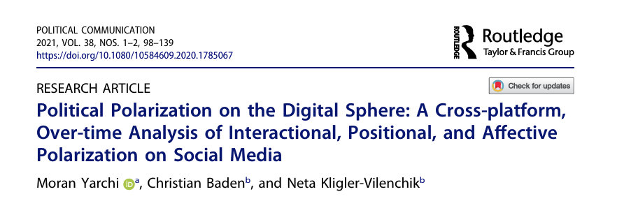

background-image: url(https://upload.wikimedia.org/wikipedia/en/6/6a/Logo_of_the_University_of_Sydney.svg)
background-size: 95%

```{r setup, include=FALSE}

knitr::opts_chunk$set(echo = TRUE, message = FALSE, warning = FALSE, 
                      dev = 'svg', out.width = "45%", fig.width = 6,
                      fig.align="center")

```

## Acknowledgement of Country

I would like to acknowledge the Traditional Owners of Australia and  recognise their continuing connection to land, water and culture. The  University of Sydney is located on the land of the Gadigal people  of the Eora Nation. I pay my respects to their Elders, past and present.


---

.content-box-green[

**Note** When not otherwise referenced, materials are based on and adapted from from Klinger, U., Kreiss, D., & Mutsvairo, B. (2023). *Platforms, power, and politics: An introduction to political communication in the digital age*. Polity.

]

---

## Chapter Overview

- Examines how elections and referendums are shaped by digital platforms.
- Focuses on campaign strategies: gaining attention, interaction, persuasion, mobilisation, and demobilisation.
- Contextualises changes within different political and media systems.
- Introduces the “four ages of campaigning” model.

---

## In-class task!

.center[.content-box-green[

In-class tasks during lectures are not assessed but participation is timestamped and recorded.

]]

.center[ 

or try https://sres.sydney.edu.au/go/67f2f60ede35554018fd4e8c

]

---
class: segue-red

# Introduction

---

## Campaigning in a Platform Age

> "Political communication during these campaign periods is decisively different from 'normal,' non-electoral times."

.center[]

- Campaign periods are key moments of political communication.
- Elections are now data-driven and highly personalised.
- Platforms are central to these transformations.

---

## Campaigning and Democratic Legitimacy

- Campaigns must produce *legitimate results* through fair procedures.
- Even humorous contests (like NZ’s “Bird of the Year”) show how emotional and affective campaigning can be.

> “Campaigning is often affective and emotional.” 

.center[]

.footnote[New Zealand’s bird of the year competition (2019), won by the hoiho, or yellow-eyed penguin, has faced claims of Russian meddling. Photograph: Murdo Macleod/The Guardian]

---

## Threats to Electoral Integrity

.pull-left[

- **Delegitimising elections**
  - Political leaders and media actors may claim elections are "rigged" or unfair without evidence.
  - These narratives can erode public trust in electoral outcomes and weaken democratic norms.
  - *“Strategic claims that elections are not free and fair... democracy is in danger.”* 


]

.pull-right[

- **Expanding executive power**

  - Leaders in hybrid or authoritarian regimes often exploit legal mechanisms to centralise power.
  - Examples include Erdogan in Turkey and Orbán in Hungary.
  - These expansions may be legal, but they undermine checks and balances.

- **Harassing opposition**
  - Use of state resources, media manipulation, and legal persecution to silence or intimidate political opponents.
  - Can include disinformation campaigns or delegitimisation of dissenting voices.


]


---

### The role of belief and legitimacy:

> “The stability of a democratic regime rests, in large part, on the belief of its leaders and citizens that democracy is the best (or the least evil) political system.”

- **Elite commitment** is essential: political parties must be willing to lose elections and accept the results.

- **Citizen belief** in the electoral process and in future political competition is foundational.
- When adversaries become enemies and elections are framed as existential battles, democratic legitimacy weakens.


---
class: segue-red

# The Four Ages of Campaigning

---

## Ideal Types of Campaigning

> “Each era is shaped by its own predominant contexts and technologies.”

- The four ages are ideal types, not mutually exclusive.

- Campaigns often mix elements from multiple eras.

---

## 1. Party-Centred Campaigning

- Dominant in the 19th–mid 20th century.
- Strong party apparatuses coordinated campaign messages.
- Emphasis on identity and rewards (e.g., jobs for partisans).

.center[]

---

## 2. Mass Media-Centred Campaigning

- TV-driven era starting mid-20th century.
- Campaigns adapted to media logics: sound bites, visuals.
- Professionals planned messaging based on polling and ratings.

.center[]

> “The longer process of how parties adapted to the logic of mass media is generally called ‘mediatization’.”

---

## Target-Group-Centred Campaigning

> "Broadcasting messages to the mass public increasingly sat alongside what scholars called 'narrowcasting' by the 1990s."

### Key Features

- **Era:** Emerged post-1970s, accelerated in the 1980s and 1990s with the rise of **cable and satellite television** and the early **Internet**.
- **Shift:** From general public messaging → to segmented, 

.content-box-purple[

Data-informed communication aimed at **specific demographic, ideological, or consumer groups**.

]

- Campaigns began using **direct mail, email newsletters, digital ads**, and early websites to reach selected voters.

---

### Narrowcasting Replaces Broadcasting

> “Political actors increasingly sought to tailor messages to predefined target groups.” 

.content-box-yellow[

.center[Narrowcasting = targeted appeals instead of one-size-fits-all messages.]

]

- Target groups defined by:
  - **Partisanship**
  - **Race, religion, or ethnicity**
  - **Consumer preferences**
  - **Geography**
  - **Affiliations and identities**

---

### Data and Technology-Driven Strategies

- Growth of **data infrastructures** for managing voter information.
- U.S. parties built vast databases to:
  - Identify relevant voter segments.
  - Optimise messaging for each group.
  - Allocate resources strategically.

---

### Fragmentation of Public Attention

- With more media outlets and Internet access, it became harder to capture mass attention.
- Campaigns had to work harder to identify where their audiences were and **how to reach them** effectively.

.center[]

---

### Strategic Implications

- Rise of **issue-specific appeals** and identity politics.
- Increased use of **marketing techniques** (e.g. segmentation, audience testing).
- Greater **efficiency**, but also potential for **echo chambers** and **selective exposure**.

---

## 4. Individual-Centred Campaigning

> “Extending this general trend... enabled parties and their candidates to send more personalized messages to voters by mining, compiling, and integrating data...”

### Key Features

- Emerged in the **post-2008** era, particularly visible in the **Obama and Trump campaigns**.
- Campaigns use **big data analytics** and **AI** to target voters at the **individual level**, based on:
  - Social media activity
  - Demographics
  - Purchase history
  - Political behaviour
  - Geographic and network data

---

### Microtargeting and Personalisation

> “Campaigns increasingly moved to scoring individual citizens’ probability of voting particular ways...”

- **Microtargeting**: crafting messages to individuals based on predicted political behaviours.
- Scores determine:
  - Likelihood to vote
  - Persuasiveness of an issue appeal
  - Type of content most likely to resonate
- Personalised ads are deployed across social media and search platforms (e.g. Facebook, Google, YouTube).

---

### A/B Testing and Real-Time Optimisation

> “Campaigns... create many, many different versions of digital advertising... to see what combination of elements perform the best.”

- Multiple versions of messages tested:
  - Images, fonts, colours
  - Phrasing of appeals
  - Call-to-action (e.g. donate, sign up)
- **Real-time feedback** (clicks, shares, conversions) used to continuously refine strategy.

---

### Data Teams at the Centre

- Tech departments are now **core campaign units**, not just IT support.
- Use of **machine learning** and **algorithmic modelling** to predict voter behaviour.
- Large-scale investments in data teams, especially in the U.S., U.K., and Australia.

---

### Citizen Marketing & Social Dissemination

> “Strategically look to disseminate messages through the cultivation of volunteers and supporters as forms of ‘citizen marketing’.”

- Supporters actively participate in campaigns by:
  - Sharing content
  - Creating memes and TikToks
  - Adopting campaign slogans and aesthetics
- **Peer-to-peer sharing** is more persuasive and trusted than campaign-originated messaging.

---

### Strategic Implications

- **Efficiency**: reach persuadable voters with tailored appeals.
- **Risks**:
  - **Echo chambers** and **filter bubbles**
  - **Manipulation** and lack of transparency
  - **Dark participation**: covert disinformation, trolling, harassment (see subversive campaigning)
  
  
---

## What’s something about election content on social media that made you stop scrolling?


.center[ 

or try https://www.menti.com/al154v8m5s2p]


---

<div style='position: relative; padding-bottom: 56.25%; padding-top: 35px; height: 0; overflow: hidden;'><iframe sandbox='allow-scripts allow-same-origin allow-presentation' allowfullscreen='true' allowtransparency='true' frameborder='0' height='315' src='https://www.mentimeter.com/app/presentation/al2sbq4v15xoeazi743mvyh479qzvb2p/embed' style='position: absolute; top: 0; left: 0; width: 100%; height: 100%;' width='420'></iframe></div>


---

.center[]

### Study Overview
- Examines **three types of political polarisation** on Facebook and Twitter in Israel:
  - **Interactional**: tendency to engage only with ideologically similar actors
  - **Positional**: divergence in issue stances between left and right
  - **Affective**: emotional hostility between camps
  
---

### Methodology
- **Cross-platform, longitudinal analysis (2017–2019)**
- Analysed posts and comments from **four Israeli media outlets** across ideological lines
- Combined **computational methods and content analysis**:
  - Used NLP for stance/emotion detection
  - Network analysis for interaction patterns
  
---

### Key Findings
- **Interactional polarisation** strongest on **Twitter**, weaker on Facebook
- **Positional polarisation** high and **increasing over time**
- **Affective polarisation** was **stable but significant**, with **stronger negativity on Facebook**
- Left and right camps behave differently depending on the platform:
  - Right-wing users more **emotionally expressive**
  - Left-wing users more **issue-focused**

.content-box-yellow[

### Implications
- Platforms shape the nature of political discourse and polarisation
- Highlights need to consider **platform-specific dynamics** in political communication studies
- Suggests that digital public spheres are **not uniform**—structure and **affordances** matter

]


---
class: segue-red

# Campaigns, Platforms, and Outcomes

---


## Do Platforms Decide Elections?

> “Elections are not won or lost on social media.”

- Structural factors (e.g. economy, incumbency) matter more.

- Platforms amplify, coordinate, and fundraise—but they’re not magic bullets.

- Platforms do not brain-wash people, turning progressives into conservatives or gardening-loving old ladies into far-right activists.   

---

## Context is Crucial

- Campaign effects vary by country, platform, regulation, and party system.

- Example: Social media helps outsiders only when parties are fractured.

> “When institutional elites are aligned, outsiders rarely break through.”

---

## Campaigning Beyond the Ballot Box

- Not all elections are national or high-stakes.

- Most elections do not attract significant media (new and old) attention.

- Includes referendums, local and EU elections.

> “Most research... focuses on campaigning in national elections.”

This creates a significant bias in what we think we know about the media and elections. 

---
class: segue-red

# Political Advertising in the Platform Era

---


## Political Advertising: A Historical Tool

- Long tradition of paid political ads, especially in the U.S.
- Advertising moved from newspapers → radio → TV → digital.

.pull-left[

## Platform-Powered Political Advertising

- Digital ads allow fine-tuned targeting and retargeting.
- Platforms monetise political communication.

> “Campaigns use advertising to learn more about people.”

]

.pull-right[

## Data-Driven Ad Strategies

- Collect data through clicks and retargeting.
- A/B testing optimises image, font, layout, colour.
- Behavioural and perceptual effects are measured in real time.

]


---
class: segue-red

# Platform Campaign Strategies

---


## Attention and Interaction

> “Candidates treated websites primarily as one-way... This began to change during the early and mid-2000s.”

- **Interactivity** now central to campaign strategy.
- Platforms offer controlled environments for structured engagement.

## Mobilisation and Demobilisation

- Platforms mobilise volunteers, donations, votes.
- Also used to demobilise opponents via disinformation or discouragement.

---
class: segue-red

# Political Targeting and Regulation

---


## Data and Privacy Matter

- U.S. has weak privacy laws → extensive microtargeting.
- Germany prohibits storage of personal data (e.g. race, religion).

> “Restrictions... make micro-targeting or individual-level scoring impossible.”

.pull-left[

## Global Variation in Campaign Practice

- Legal frameworks shape how campaigns use platforms.
- Federal candidates have more resources for digital infrastructure.

]


.pull-right[

## Platform Incentives

- Facebook and Google dominate ad markets.
- Algorithms reward content that increases engagement—often emotional or extreme.

]


---
class: segue-red

# Comparative Campaigning and Research Gaps

---


## Local vs National Dynamics

- Social media less influential in local elections.
- Mass media still dominant in places with strong local press.

## Cross-National and Platform Research Gaps

- Most studies focus on U.S., Twitter, Facebook.
- Need more comparative and Global South research.

---
class: segue-red

# Summary and Implications

---


## Campaigning in the Platform Age

- Campaigns have become more personalised, emotional, and data-driven.
- Platforms offer low-cost access, interactivity, and targeting—but context matters.

--

## Key Takeaways

- Platforms shape, but don’t determine, election outcomes.
- Campaigning is now a hybrid of old and new techniques.
- Regulation and political context determine platform effects.

---
class: center, middle
# Attendance

## Get your phone out!


---
class: inverse, center, middle

# Any Quick Question?

---
class: center, middle

# See you next week!


