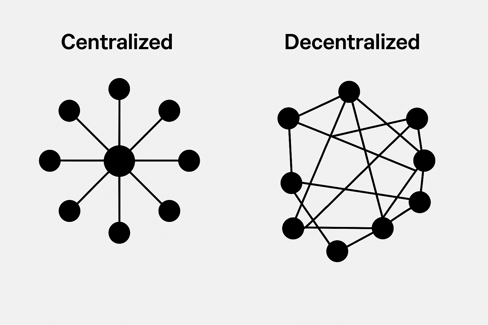

background-image: url(https://upload.wikimedia.org/wikipedia/en/6/6a/Logo_of_the_University_of_Sydney.svg)
background-size: 95%

```{r setup, include=FALSE}

knitr::opts_chunk$set(echo = TRUE, message = FALSE, warning = FALSE, 
                      dev = 'svg', out.width = "45%", fig.width = 6,
                      fig.align="center")

```

## Acknowledgement of Country

I would like to acknowledge the Traditional Owners of Australia and  recognise their continuing connection to land, water and culture. The  University of Sydney is located on the land of the Gadigal people  of the Eora Nation. I pay my respects to their Elders, past and present.


---

.content-box-green[

**Note** When not otherwise referenced, materials are based on and adapted from from Klinger, U., Kreiss, D., & Mutsvairo, B. (2023). *Platforms, power, and politics: An introduction to political communication in the digital age*. Polity.

]

---
class: segue-red

# Introduction

---

## Digital Movements in a Global Age
- “Platforms have decisively changed the notion of what it means to be part of a movement.”
- `#EndSARS` as a global example of hashtag-based solidarity: from Nigeria to Washington, Mumbai, and Santiago.
- Platforms globalise struggles, spotlight injustice, and activate affective publics.

## What is a Movement?
- “All you need is people.”
- Movements = shared identity, drive, belief, action.
- Can fight *for* or *against* change.

---

## Contemporary Importance of Movements
- In an era of: climate change, racism, sexism, pandemics, mental health crises, and more.
- “Movements have helped us understand them as problems to be addressed through politics.”

## Variety and Form
- **Political ends** (e.g. campaign finance) vs. **lifestyle changes** (e.g. environmental sustainability).
- **Violent** or **non-violent**; formal organisations or spontaneous protests.
- Example: “quiet encroachment” in authoritarian regimes (Bayat 2013).

> “The urban poor made sure to secure shelter, consolidate their communities, and earn a living by devising work in the vast subsistent and street economy [...] youths took every opportunity to affirm their autonomy, challenge social control and plan for their future…” (Bayat, 2013, p. 589).

.footnote[Bayat, A. (2013). The Arab Spring and its surprises. *Development and Change, 44*(3), 587–601.]

---

## In-class task!

.center[.content-box-green[

In-class tasks during lectures are not assessed but participation is timestamped and recorded.

]]

.center[ 

or try https://sres.sydney.edu.au/go/67fc2ffdde3555401806746f

]


---
class: segue-red

# Defining Social Movements

---

## What Are Social Movements?

- Social movements pre-date the term itself.
- Lorenz von Stein’s *History of the French Social Movement* (1848) is among the earliest uses of the term.
- Classic example: the American Revolution (Tilly 2004).

.center[]

.footnote[Tilly, C. (2004). *Social movements, 1768–2004*. Paradigm Publishers.]

---

## Social Movements: Definitions and Key Elements

> “Networks of informal interactions between a plurality of individuals, groups and/or organizations, engaged in political or cultural conflicts, on the basis of shared collective identities.” – *Diani (1992)*

**Key characteristics:**
- **Networks**: Movements consist of loosely connected individuals and organisations.
- **Informality**: Not all movements are formally structured.
- **Conflict-driven**: Political or cultural conflict is central.
- **Collective identity**: Shared sense of purpose binds actors.

.footnote[Diani, M. (1992). The concept of social movement. *The Sociological Review, 40*(1), 1–25. https://doi.org/10.1111/j.1467-954X.1992.tb02943.x]

---

## What Do Movements Do?

- Form alliances between different actors (e.g. environmental and labour groups).
- Develop shared beliefs that:
  - Critique the status quo
  - Propose solutions
  - Justify political action (Gillan 2008): Moral framing, Legitimacy claims, Narratives and urgency of harm, etc.

.footnote[Gillan, K. (2008). Understanding meaning in movements: A hermeneutic approach to frames and ideologies. *Social Movement Studies, 7*(3), 247–263.]

### A working defintion of social movements

> "Social movements are **networks of actors** organised around **convergent identities and interests** pursuing change — or resisting change — in response to perceived deficiencies in the status quo."

---

## Movements and Democracy

- Movements can both **strengthen** and **destabilise** democratic systems.
- Example: Right-wing nativist movements opposing demographic change.
- Counter-example: Movements for greater democratic inclusion and equality.
- Backlash is common (e.g. white backlash to Black Lives Matter in the US).

---

## Movements in Global Perspective

- Movements are active globally — in democracies and authoritarian states alike.
- **Examples:**
  - Activists in Burkina Faso and Belarus challenge political elites.
  - COVID-19 catalysed digital activism across Southeast Asia (Corpuz 2021).

## The Risks and Costs of Movements

- **Repression**: Threat of jail, violence, or death (especially in authoritarian states).
- **Endurance**: Many activists don’t live to see the change they seek.
  - *e.g. Martin Luther King Jr.*
  
.footnote[Corpuz, J. C. (2021). COVID-19 and the rise of social activism in Southeast Asia: A public health concern. *Journal of Public Health, 43*(2), 344–365.]

---

## Movements as Agents of Change

- Movements can shape:
  - **Policy**
  - **Public discourse**
  - **National identity**
  - **Political systems**

- Their influence is amplified when supported by:
  - Strong leadership
  - Media visibility
  - Political allies
  - Organisational networks

---
class: segue-red

# Theories of Social Movements

---

## 1. Resource Mobilisation Theory (RMT)
- Movements need money, people, time, skills (McCarthy & Zald 1977).
- “Without sufficient funding, it is almost impossible to fight dictatorships.”

## Spotlight: Open Society Foundation
- Open Society Foundation (OSF) provides civil society funding – often targeted by conspiracy theories.

.center[]

.footnote[McCarthy, J. D., & Zald, M. N. (1977). Resource mobilization and social movements: A partial theory. *American Journal of Sociology, 82*(6), 1212–1241.]

---

## 2. New Social Movement Theory
- Shift from **class** to **identity**: gender, race, sexuality, culture.
- **Identity as democratic struggle**: for equality, equity, recognition.
- Example: **Feminism** = political and cultural transformation.

.center[]

.footnote[[Emmeline Pankhurst](https://en.wikipedia.org/wiki/Emmeline_Pankhurst) addresses a crowd in New York City in 1913 (Source: Wikipedia)]

---

## 3. Deprivation Theory
- Movements arise from **perceived** or **real** deprivation.
- Absolute vs. relative deprivation (Sen & Avci 2016).
- Example: **Saudi women's right to drive**Covid protests – gains and silences.

.center[]

.footnote[Sen, A., & Avci, O. (2016). Why social movements occur: Theories of social movements. *Journal of Knowledge Economy and Knowledge Management, 11*(1), 125–130.]

---

## 4. Political Process Theory
- Success shaped by political opportunity structures.
- Unified elites = movement failure; elite division = opportunities.
- Example: **Covid protests**, civil rights, anti-migration protests.

.center[]

.footnote[Protests have broken out in the US from Washington state to North Carolina. Some cities have begun fining people. Alex Milan Tracy/Sipa USA (Source: *The Conversation*)]
---
class: segue-red

# Movements in Platform Contexts

---

## From Organisation (Collective Action) to Connective Action

- Pre-digital movements needed resources, offices, permits, infrastructure.
- Classic problem: “free riding” (Olson 1965).

## Connective Action (Bennett & Segerberg 2013)

- Decentralised, individualised expression via platforms.
- Hybrid forms: movements with organisational cores using digital tools.

.center[]

.footnote[Olson, M. (1965). *The logic of collective action: Public goods and the theory of groups*. Harvard University Press. Bennett, W. L., & Segerberg, A. (2013). *The logic of connective action: Digital media and the personalization of contentious politics*. Cambridge University Press.]

---

## Spotlight: Fridays for Future
- Greta Thunberg’s solo protest → global youth movement.
- “Decentralised structure supported through social media platforms.”

.content-box-yellow[

BUT **far-right movements** also excel at decentralised digital organising.

]

## Connective Action on the Right

.pull-left[
PEGIDA (Patriotic Europeans against the Islamification of the Occident, Germany) grew from a Facebook group to 15,000+ strong demos.]

.pull-right[.center[]]


---

class: segue-red
# Platforms & Movement Communication

---

## Networked Mobilisation
- No central-to-periphery structure.
- “Peripheral networks” matter – celebrities, influencers, and issue reframing.

## Superspreaders & Hyperactive Users
- Small % create bulk of content (e.g. 0.27% of users → 21% of tweets).
- “Superuser-supremacy” (Hindman et al. 2022).

In the next slide a .content-box-red[**mutual retweet networks**]  

> "In Period 1, far-right accounts are disconnected from the rest of the network and segregated in a peripheral community with no bridge to the rest of the network. In Period 2, the far-right is instead connected to the rest of the network, even if from a peripheral position". (Bailo et al. 2024)

.footnote[Hindman, M., Lubin, N., & Davis, T. (2022, February 10). Facebook has a superuser-supremacy problem. *The Atlantic*. https://www.theatlantic.com/technology/archive/2022/02/facebook-hate-speech-misinformation-superusers/621617. Bailo, F., Johns, A., & Rizoiu, M.-A. (2024). Riding information crises: The performance of far-right Twitter users in Australia during the 2019–2020 bushfires and the COVID-19 pandemic. *Information, Communication & Society, 27*(2), 278–296. https://doi.org/10.1080/1369118X.2023.2205479

]

---


---

## Strategic Amplification
- Loud minorities can seem like mass movements.
- Example: Anti-vax protests in Germany had outsized policy influence.

## Cross-Platform Dynamics
- Movements migrate content across YouTube, Telegram, WhatsApp, legacy media.
- Under-researched due to data access limits (platforms have been cutting access to researchers.).

---

## Intermediary Networks and Movement–Party Coordination

### From Extremist Fringe to Parliamentary Campaign

- Klinger et al. (2023) show how a far-right campaign ("**Stop the Migration Pact**") spread from the **Identitarian Movement** to the **Alternative für Deutschland (AfD)** via *network handoffs*.
- **Party leaders avoided direct association** with extremist sources while **adopting their framings**.
- **“Intermediary networks”** (low-level party activists, far-right media, superspreaders) played a laundering role:
  - Distanced the campaign from its origins,
  - Enabled uptake by high-level AfD actors.

> “Those network bridges became **source-laundering** mechanisms that obscured demonstrable collaboration [...] and charged it with political legitimacy.”

.footnote[Klinger, U., Lance Bennett, W., Knüpfer, C. B., Martini, F., & Zhang, X. (2023). From the fringes into mainstream politics: Intermediary networks and movement-party coordination of a global anti-immigration campaign in Germany. *Information, Communication & Society*, 26(9), 1890–1907. https://doi.org/10.1080/1369118X.2022.2050415]

---

## The Role of Digital Infrastructure and Superspreaders

- **Superspreaders**: 0.27% of users accounted for 21% of interactions.
- Far-right media (e.g., PI-News, Politikstube) acted as **amplifiers** and early adopters.
- The Identitarian campaign was mirrored by the AfD – even the website URL was copied (`.info` → `.de`).
- Media coverage escalated **after** party uptake, not before.
- **Platform dynamics** allowed:
  - Message laundering,
  - Agenda setting,
  - Strategic ambiguity between party and movement.

> “AfD managed to move radical ideas from the political fringes into the general debate, parliamentary debates and public discourse.”


---

## Which factors are MOST important for the success of a social movement in the platform era?


.center[ 

or try https://www.menti.com/ala5d7qtq8h4]

---

class: segue-red

# State Responses to Movements

---

## Suppression Tactics
- Legal: surveillance, disinformation, arrests.
- Extra-legal: violence, infiltration, character assassination.

## Digital Authoritarianism
- Internet shutdowns (e.g. Sri Lanka 2022), facial recognition, cyber ministries.
- Social media access restricted after Turkey detained Istanbul Mayor and opposition leader Imamoglu in March 2025.
- Mugabe (Zimbabwe) in 2017 first “Cyber Security” minister globally.

---

## Targeting Infrastructure
- Arab Spring response: shutdowns, surveillance, asset seizure.
- Infiltration sows distrust and burnout in movements.

> “Digital technology can make it even more difficult for activists to remain anonymous… IP addresses, real-name policies, and facial recognition compromise personal data.”

.center[]

.footnote[Source: https://impact.monash.edu/big-data/providing-venezuelans-with-trusted-information-in-a-time-of-crisis/]

---

class: segue-red
# Movements and Journalism

---

## A Complicated Relationship
- Media are vital but double-edged: visibility vs. sensationalism.
- Movements rely on media, but are often delegitimised or trivialised.

## Framing & Bias
- Press favours drama, not depth (Sobieraj 2011).

- Right vs. Left bias in coverage (Mourão & Chen 2020; Gruber 2023).

.footnote[Sobieraj, S. (2011). *Soundbitten: The perils of media-centered political activism*. New York University Press. Mourão, R. R., & Chen, W. (2020). Covering protests on Twitter: The influences on journalists’ social media portrayals of left- and right-leaning demonstrations in Brazil. *The International Journal of Press/Politics, 25*(2), 260–280. https://doi.org/10.1177/1940161219894965. Gruber, J. B. (2023). Troublemakers in the streets? A framing analysis of newspaper coverage of protests in the UK 1992–2017. *The International Journal of Press/Politics, 28*(2), 414–433. https://doi.org/10.1177/19401612221102058]

---

## State Influence Over Journalism
- Tactics: intimidation, censorship, paid propaganda.
- In authoritarian regimes, journalists follow state directives (Moon 2019).

.footnote[Moon, R. (2019) “Beyond puppet journalism: the bridging work of transnational journalists in a local field,” *Journalism Studies* 20(12): 1714–31.]

---

class: segue-red
# Summary


---

## Key Takeaways
1. Platforms have reshaped how movements are **organised**, **perceived**, and **repressed**.
2. Movements today are more **visible**, **decentralised**, and **dynamic** – but still vulnerable.
3. Theories like RMT, New Social Movement Theory, and Political Process Theory remain vital tools.

---
class: center, middle
# Attendance

## Get your phone out!


---
class: inverse, center, middle

# Any Quick Question?

---
class: center, middle

# See you next week!


